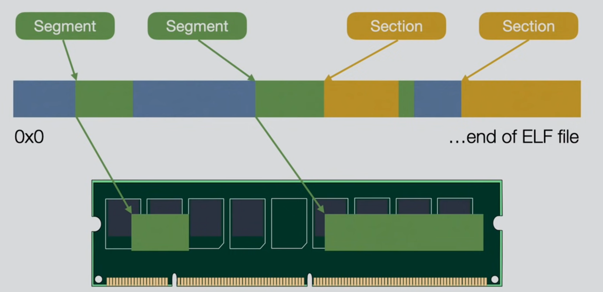
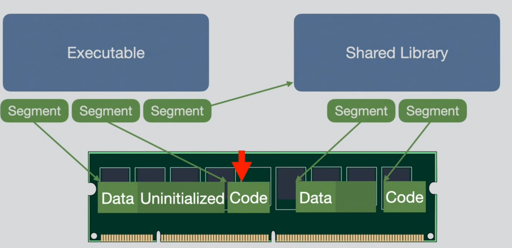

# In-depth: ELF - The Extensible & Linkable Format

- ELF is standard executable file format for Unix, Linux, most BSDs, PS4, and many more....

## Segments vs Sections

- First off, __segment is NOT the same as a section__.
- Segment is only __relevant at the runtime.__
- Section is only __relevant at the link time.__
- You can have zero or more sections and segments.
- During the execution of a program, only segments are present.
- This means that program compiled with `gcc -c` __has sections__ but __doesn't have segments__.

```sh
$ gcc prog.c -o prog.o -c
$ readelf -l prog.o

There are no program headers in this file.
```

- Main difference between segments and sections is that __segments specify *how* and *where* they will be loaded in virtual or physical memory!__.
- Segments are also loaded at an __absolute address.__
- In most programs, segments and sections overlap each other.



### Static binary example

- Two segments are stored in RAM, the __data__ segment and __code__ segment.
- Data segment contains both initialized and unitialized static global variables.
- Code segment contains executable code.
- OS loads address of the entry point.

### Dynamic binary example

- Dynamic binary contains one more segment, which tells linker which __libraries to load.__
- These loaded libraries are __also elf files, with their own segments.__
- This is more complex scenario, because there could be a ton of libraries which are loaded, and also ASLR is activated, so random addresses for each segment.




## ELF header data structure

```c
# define EI_NIDENT 16
 
typedef struct {
unsigned char
e_ident[EI_NIDENT];
Elf64_Half e_type;
Elf64_Half e_machine;
Elf64_Word e_version;
Elf64_Addr e_entry;
Elf64_Off e_phoff;
Elf64_Off e_shoff;
Elf64_Word e_flags;
Elf64_Half e_ehsize;
Elf64_Half e_phentsize;
Elf64_Half e_phnum;
Elf64_Half e_shentsize;
Elf64_Half e_shnum;
Elf64_Half e_shstrndx;
} Elf64_Ehdr;
```

- __E_IDENT__ example:

```sh
$ readelf -h unit_01/bin/arrays
ELF Header:
  Magic:   7f 45 4c 46 01 01 01 00 00 00 00 00 00 00 00 00
```

- __E_IDENT__ contains:
1. Magic bytes for ELF
2. Class - whether it's 32 bit or 64 bit ELF file (01 for 32 bit).
3. Data - How data is encoded (LSB, MSB or None)
4. Version - Always 1
5. OS ABI - Always 0 for Linux, static binaries are set to 3
6. ABI version
7. Padding

- __e_type__ can be set to:
1. Relocatable file type (Object file, `gcc -c`).
2. Executable file but no PIE, no ASLR.
3. __Shared object file, for shared libs and PIE executables.__
4. Core file for core dumps.

- __e_machine__, is machine architecture.
- __e_version__ always set to 1.
- __e_entry__ specifies entry point to our executable.
- __e_phoff__, __e_shoff__ are program and section header offsets, respectively. Offsets are relative to the beginning of a file.
- __e_flags__, OS and architecture dependent.
- __e_phentsize__, __e_phnum__ size of a single program header and number of program headers present in the binary.
- __e_shentsize__, __e_shnum__ size of a single section header and number of sections in the binary.
- __e_shstrndx__, used for resolving names of the sections.

- Example:

```sh
$ readelf -h unit_01/bin/arrays
ELF Header:
  Magic:   7f 45 4c 46 01 01 01 00 00 00 00 00 00 00 00 00
  Class:                             ELF32
  Data:                              2's complement, little endian
  Version:                           1 (current)
  OS/ABI:                            UNIX - System V
  ABI Version:                       0
  Type:                              EXEC (Executable file)
  Machine:                           Intel 80386
  Version:                           0x1
  Entry point address:               0x8049050
  Start of program headers:          52 (bytes into file)
  Start of section headers:          13376 (bytes into file)
  Flags:                             0x0
  Size of this header:               52 (bytes)
  Size of program headers:           32 (bytes)
  Number of program headers:         12
  Size of section headers:           40 (bytes)
  Number of section headers:         30
  Section header string table index: 29
```


## Program header data structure

```c
typedef struct {
	Elf32_Word	p_type;
	Elf32_Off	p_offset;
	Elf32_Addr	p_vaddr;
	Elf32_Addr	p_paddr;
	Elf32_Word	p_filesz;
	Elf32_Word	p_memsz;
	Elf32_Word	p_flags;
	Elf32_Word	p_align;
} Elf32_Phdr;
```

- `p_type` describes the type of a segment.
- `p_type` can be many things, `INTERP` indicates that it's dynamic executable.
- `p_offset` specifies where the contents of this segment are located in the binary.
- `p_flags` describe permissions of the segment (rwx).

- Example:

```sh
$ readelf -l unit_01/bin/string

Elf file type is EXEC (Executable file)
Entry point 0x8049050
There are 12 program headers, starting at offset 52

Program Headers:
  Type           Offset   VirtAddr   PhysAddr   FileSiz MemSiz  Flg Align
  PHDR           0x000034 0x08048034 0x08048034 0x00180 0x00180 R   0x4
  INTERP         0x0001b4 0x080481b4 0x080481b4 0x00013 0x00013 R   0x1
      [Requesting program interpreter: /lib/ld-linux.so.2]
  LOAD           0x000000 0x08048000 0x08048000 0x003c4 0x003c4 R   0x1000
  LOAD           0x001000 0x08049000 0x08049000 0x001dc 0x001dc R E 0x1000
  LOAD           0x002000 0x0804a000 0x0804a000 0x0012c 0x0012c R   0x1000
  LOAD           0x002ef8 0x0804bef8 0x0804bef8 0x00118 0x0011c RW  0x1000
  DYNAMIC        0x002f00 0x0804bf00 0x0804bf00 0x000e8 0x000e8 RW  0x4
  NOTE           0x0001c8 0x080481c8 0x080481c8 0x00078 0x00078 R   0x4
  GNU_PROPERTY   0x0001ec 0x080481ec 0x080481ec 0x00034 0x00034 R   0x4
  GNU_EH_FRAME   0x002030 0x0804a030 0x0804a030 0x00034 0x00034 R   0x4
  GNU_STACK      0x000000 0x00000000 0x00000000 0x00000 0x00000 RWE 0x10
  GNU_RELRO      0x002ef8 0x0804bef8 0x0804bef8 0x00108 0x00108 R   0x1
```

## Section header data structure

- __Remember that sections are present only at the link time and are used mainly by debuggers.__
- Running programs can work fine without sections:

```sh
$ strip --strip-section-headers helloworld
$ readelf --sections helloworld

There are no sections in this file.
$ ./helloworld
Hello world!
```

- `sh_type` can be set to many types.
- Among those types are `SHT_PROGBITS` which is data for the program.
- And, `SHT_DYNAMIC` which contains information about dynamic linking.
- Example:

```sh
$ readelf -S unit_01/bin/endian
There are 30 section headers, starting at offset 0x3440:

Section Headers:
  [Nr] Name              Type            Addr     Off    Size   ES Flg Lk Inf Al
  [ 0]                   NULL            00000000 000000 000000 00      0   0  0
  [ 1] .interp           PROGBITS        080481b4 0001b4 000013 00   A  0   0  1
  [ 2] .note.gnu.bu[...] NOTE            080481c8 0001c8 000024 00   A  0   0  4
  [ 3] .note.gnu.pr[...] NOTE            080481ec 0001ec 000034 00   A  0   0  4
  [ 4] .note.ABI-tag     NOTE            08048220 000220 000020 00   A  0   0  4
  [ 5] .gnu.hash         GNU_HASH        08048240 000240 000020 04   A  6   0  4
  [ 6] .dynsym           DYNSYM          08048260 000260 000070 10   A  7   1
--- snip ---
```

-----

#### Resource

1. https://www.youtube.com/watch?v=nC1U1LJQL8o
2. https://refspecs.linuxbase.org/elf/gabi4+/ch4.sheader.html
