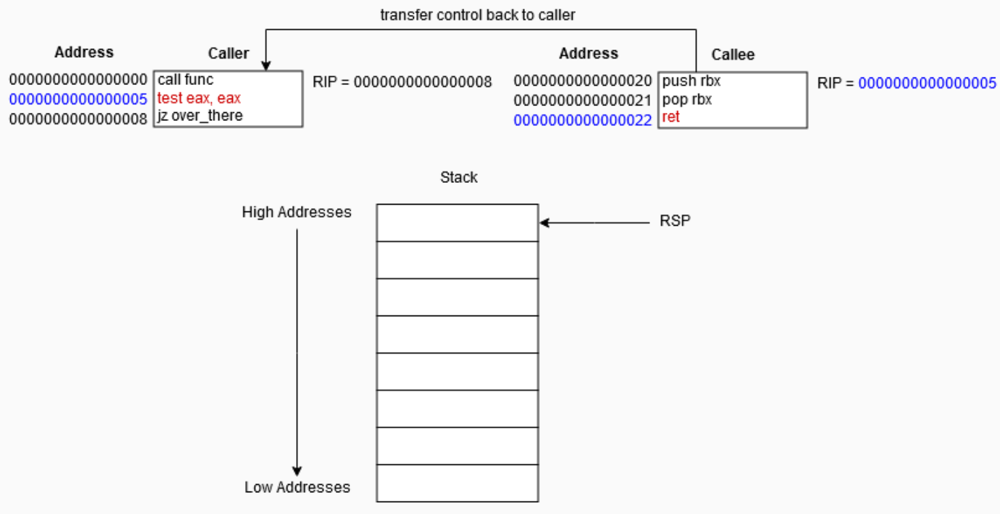
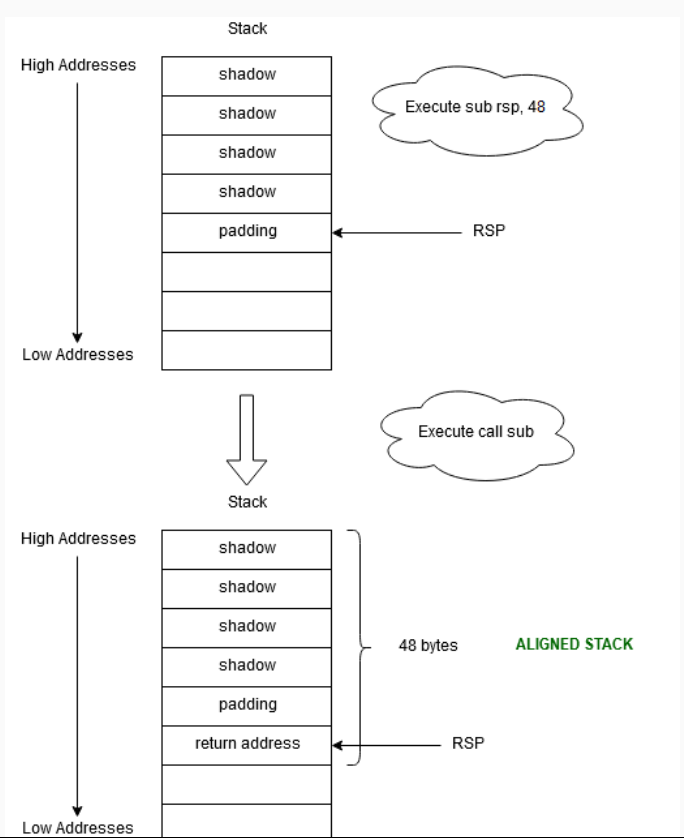
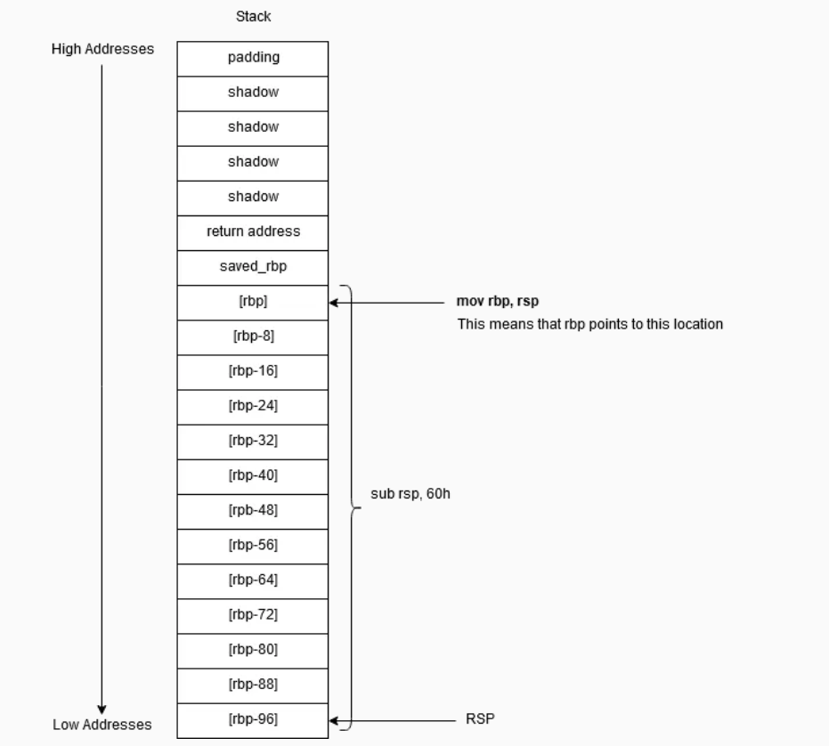

# Applied Reverse Engineering: The Stack

## Stack

- Stack is a structure based on __LIFO principle__.
- Stack is a __contiguous array of memory__, contiguous means that the data stack holds is stored in __order one after another.__
- Stack is not managed only by `RSP` it's also managed by the __segment register `SS` (stack segment).__
- Stack segment contains data and return address of a caller.
- Stack segment `SS` is used to reference the stack.

- Example usage of `SS`:

```asm
mov rbx, qword ptr ss:[rsp]
```

- This will move anything that was placed at `rsp+0` offset into `rbx`.
- To be more precise it moves data that is at the top of the stack into `rbx`.
- But know that in this case `pop rbx` is much faster and preferred instruction.

- All segment registers except `FS` and `GS` are __zero based.__
- `FS` and `GS` are used in Windows to point to some critical OS structures.

### `call` instruction and types

- 4 types of `call` instructions:
1. Far call
2. Near call
3. Inter-privilege-level far call
4. Task switch

- In x64, near call is what interests us.
- Near call's two opcodes are `E8` and `FF`.
- Near call doesn't change the `CS` (__Code Segment__) register, but far call does.
- 64 bit OS uses __flat memory model__, meaning __any memory__ can be accessed from the __same segment.__
    - That's why segment registers are 0 based.

- Near call types are:
1. __Near relative `E8`__
2. __Near absolute `FF`__

#### Near relative call `E8`

- Take the following example:

```asm
 8049188:       e8 23 ff ff ff          call   80490b0 <__x86.get_pc_thunk.bx>
 804918d:       81 c3 67 2e 00 00       add    ebx,0x2e67
```

- See the opcode `e8` (near relative call) and `23 ff ff ff` which is a 4 byte call target __relative to the next instruction.__
- You take that 4 byte call respecting the little endian, so it's `ff ff ff 23` and you sign extend it, because it starts with `ff`.
- So it becomes `ff ff ff ff ff ff ff 23`, you add that relative address to the `804918d` and you end up with the address of the function.
- That's how near relative calls work.


#### Near absolute call `FF`

- Near absolute calls are indirect, while near relative calls are direct.
- They take memory address from a register or some other place and place it into `RIP`.
- Example of near absolute call:

```asm
8049019: ff d0  call eax
```


## `call` instruction

- Near relative call, calls some function, it jumps to the start of the address of that function.
- __*Remember: target operand (function's address) is always 64-bit in 64 bit mode.*__
- It first pushes the value of return address (that is `RIP` which holds address of the next instruction in caller function).
- That new pushed value is used as __return-instruction pointer__.


### `ret` instruction

- This instruction transfers program execution to the return address.
- The return address of caller is stored at the top of the stack.
- If __near call__ was used to call the function, then a __near return__ is used to return from the function.
- Near return __pops the return instruction pointer__ into `RIP` and resumes execution from there.

- This diagram shows execution of `call` instruction and just before executing the `ret` instruction.


- You can see current `RIP` holds the address of the next instruction in caller function.
- Next diagram shows how `ret` instruction when executed pops of the return address into `RIP`.




## Calling conventions and Microsoft ABI

- Compiler uses a __calling convention__ to setup an access to a function.
- Calling convention specifies __how arguments are passed to a function, and how a function returns some values.__
- It also specifies how the function is invoked and how it manages it's stack and stack frames.
- One of those calling conventions is Microsoft's __fastcall__.
- From the Microsoft's docs:
> The \__fastcall calling convention specifies that arguments to functions are to be passed in registers, when possible.

- In x86 assembly, there were 3 calling conventions: __stdcall, cdecl, fastcall__.
- However, Windows uses \__fastcall convention in all 64 bit programs.

### ABI

- __ABI (Application Binary Interface)__ is an interface between the program and OS.
- It's a set of conventions used for defining __data types, their size, alignment, calling conventions...__
- Compilation process (specifically assembling stage) depends on ABI.


### \__fastcall convention

- This convention uses 4 registers to pass arguments to a function, in the following order: `rcx`, `rdx`, `r8`, `r9`.
- So if a function requires two `int` arguments, it would be used like this:

```asm
mov edx, 4          ; second argument
mov ecx, 8          ; first argument
call sub            ; function call
```

- Return value is passed in `rax`, for most x64 ABI.

- __Any argument that doesn't fit in 1,2,4 or 8 bytes must be passed by a reference.__
    - That is because arguments can't be split across multiple registers.
- Floating point operations are done with __XMM0-XMM15__ registers.
- The caller function must allocate space on the stack for the __callee function__ to store arguments passed with 4 registers.
    - This space has a name and is called __shadow space__.
    - Size of this space is calculated as maximum size supported (8 bytes) * number of registers used to pass arguments (4), which is 32 bytes.

> Prior to a function call the stack must be always aligned to 16-byte boundary.

- So in assembly the complete picture with shadow space allocation looks like:

```asm
sub rsp, 40         ; sub rsp, 32 (shadow store) + 8 (alignment pad) = > 40, this way 8 bytes for call will keep stack aligned
mov edx, 4          ; second argument
mov ecx, 8          ; first argument
call sub            ; function call
```

- Additional 8 bytes are reserved on the stack, for the return address (alignment pad).
- This is what shadow space looks like presented in the following diagram.



## Stack frame

- Stack frame represents function call and arguments data, along with local variables stored in stack.
- Shadow space is __not a part of the stack frame__.
- Stack frame consists of:
1. The return address
2. Base pointer
3. Local variables

- Sometimes in small functions, stack frame won't be created. Instead only registers will be used.
- Old base pointer gets pushed on the stack, then it gets set with `rsp`.
- This `rbp` gets referenced for local variables in the stack frame, and that's the purpose of `rbp` in stack frame.
- After the function prologue, stack looks like this:





- Positive offsets to `rbp` access arguments passed on the stack.
- Negative offsets to `rbp` access local variables.

### Passing large arguments to functions

- Take the example of string which is declared as:

```c
printf("Elapsed Time = %u\n", ElapsedTime);
```

- This string needs to be passed by reference, because __none of the registers can hold it.__
- This is done in assembly like:

```asm
mov rdx, ElapsedTime
lea rcx, offset elapsed_string
call printf
```

- The characters from string gets moved into `edx`. These are just unsigned numbers (ascii values).
- The type specifier and the remainder of the string gets loaded into `rcx`.
- Whenever you see `lea` instruction, it's probably loading a large argument, most likely a string.

-----

#### Sources

1. https://revers.engineering/applied-re-the-stack/
2. https://www.tutorialspoint.com/assembly_programming/assembly_registers.htm
