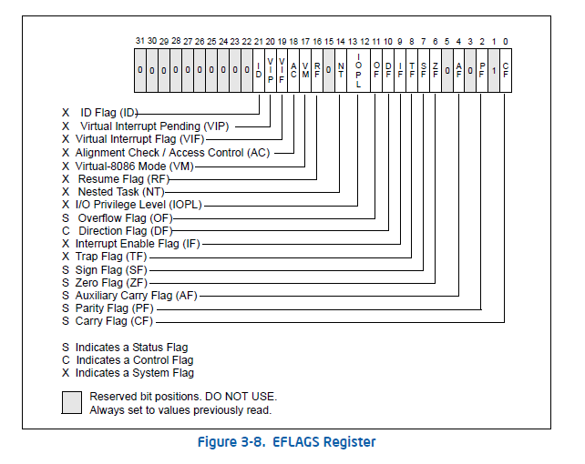

# Applied Reverse Engineering: Basic Architecture 

## The Microarchitecture

- __Microarchitecture__ is all __digital logic__ that allows an instruction set to be executed.
- When you combine logic gates with an ALU, CU, registers,... you get a __processor__.
- In any processor following can be found:
1. An ALU
2. Register file
3. Cache mememory
4. Branch prediction

## Register file

- __Register file__ is an array of processor registers used to store temporary data and operate on it.
- Registers are a lot of times faster than the CPU cache memory, but they are much smaller in size.

## Processor State Flag Register

- EFLAGS (x86), RFLAGS (x86-64), and CPSR (Current Program Status Register) are three different names for the __same thing.__
- This is already done in [EFLAGS](../../tasks/flags/control_flow.md)
- But here's a nice layout picture:



## The Carry Flag exercise

- I've written `carryflag.c` with the help of ChatGPT.
- Going through the code in `gdb`, here's what it's doing with the `carry` variable:

```sh
(gdb) si
11          uint8_t carry = (sum >> 8) & 1;
2: x/3i $pc
=> 0x55555555516e <main+37>:    movzx  eax,WORD PTR [rbp-0x2]
   0x555555555172 <main+41>:    shr    ax,0x8
   0x555555555176 <main+45>:    and    eax,0x1
(gdb) p /t $ax
$7 = 100101100  # that is 300 in decimal, notice the 9th bit is 1, this is the result of CF being set
--- snip --
(gdb) p /t $ax  # after the shift and AND logical operation, the result is 1 as expected
$8 = 1
```

- To print the value of `EFLAGS` register:

```sh
(gdb) p $eflags
$10 = [ IF ]
```

- I couldn't get the C code to generate equivalent assembly code that includes `jc` jump.
- Also the `EFLAGS` doesn't seem to include `CF` when executing `carryflag` line by line.
- Some of the previous code I've wrote, managed to alter `EFLAGS` to include `CF` but was buggy, hence removed.
- Other examples of what ChatGPT offered as a solution included inline assembly to directly use `jc` jump.

---

#### Sources

1. https://revers.engineering/applied-re-basic-architecture/
