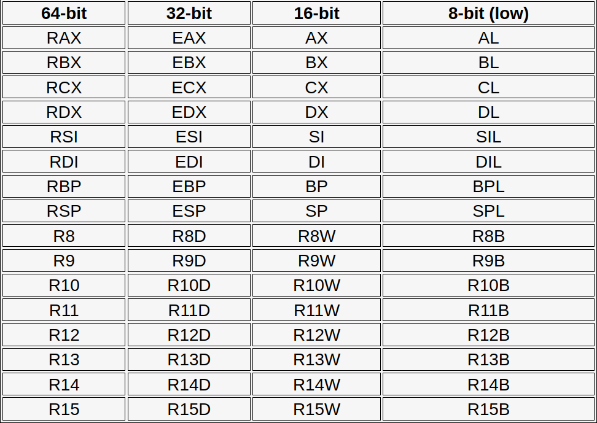

# Intro to assembly

- Most of this is already done in `tasks/` directory.
- But because it introduces x64 assembly too, I will make some notes about it.

## Registers

- Here's a list of x64 registers:

```
Special purpose:
rbp: Base Pointer, points to the bottom of the current stack frame
rsp: Stack Pointer, points to the top of the current stack frame
rip: Instruction Pointer, points to the instruction to be executed

General Purpose Registers
These can be used for a variety of different things.
rax: for returning a value from a function
rbx: base register
rcx: fourth argument
rdi: first argument (destination for data copies)
rsi: second argument (source for data copies)
rdx: third argument
r8: fifth argument
r9: sixth argument
r10-r15: storing temporary data and performing operations on them.
```

- And their sizes:





## Stack

- Consider the program `stack.c`, disassemble it and see how variable `x` is stored on the stack:

```sh
0000000000001139 <main>:
    1139:       55                      push   rbp
    113a:       48 89 e5                mov    rbp,rsp
    113d:       48 83 ec 10             sub    rsp,0x10
    1141:       c7 45 fc 05 00 00 00    mov    DWORD PTR [rbp-0x4],0x5
    1148:       48 8d 05 b5 0e 00 00    lea    rax,[rip+0xeb5]        # 2004 <_IO_stdin_used+0x4>
    114f:       48 89 c7                mov    rdi,rax
    1152:       e8 d9 fe ff ff          call   1030 <puts@plt>
    1157:       b8 00 00 00 00          mov    eax,0x0
    115c:       c9                      leave
    115d:       c3                      ret
```

- It's at the `rbp-0x4` on the stack.
- `rbp` points to the bottom of stack, `rsp` points to the top of stack.

## Instructions

### Dereferencing

```asm
mov [rax], edx
```

- Will move a value from `edx` into whatever `rax` is pointing at, `rax` by itself doesn't change.

### `lea`

```asm
lea eax, [ebp-0x4]
```

- This will calculate the address of second operand and put it into `eax`.

---

Sources:
1. https://github.com/hoppersroppers/nightmare/blob/master/modules/01-intro_assembly/assembly/readme.md
2. https://www.youtube.com/watch?v=75gBFiFtAb8
