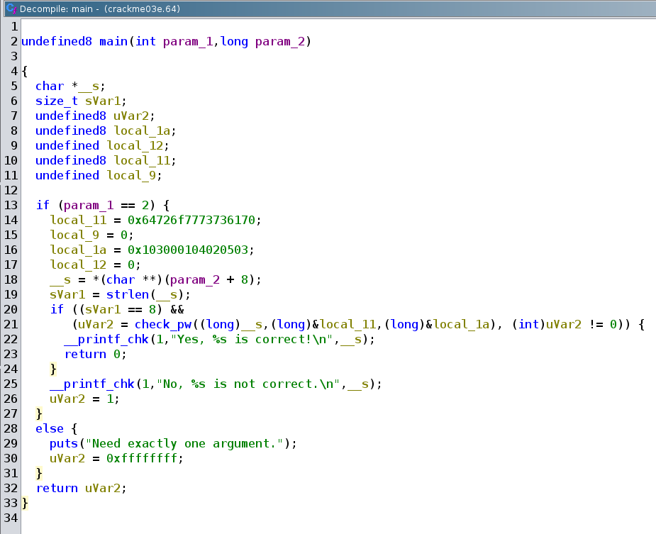
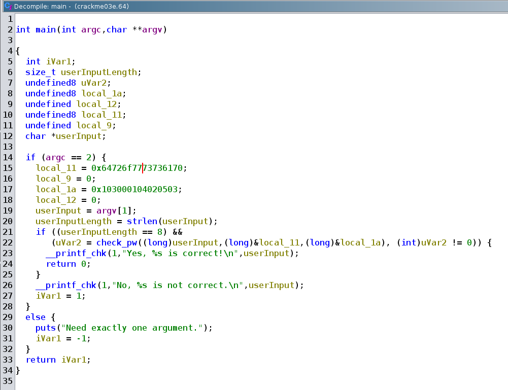
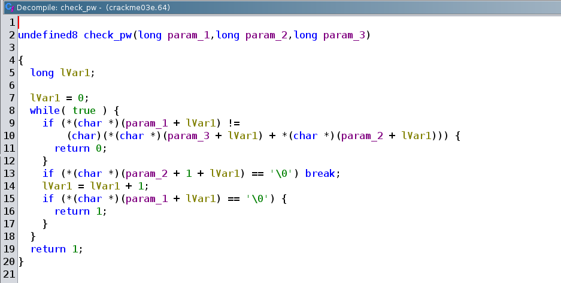
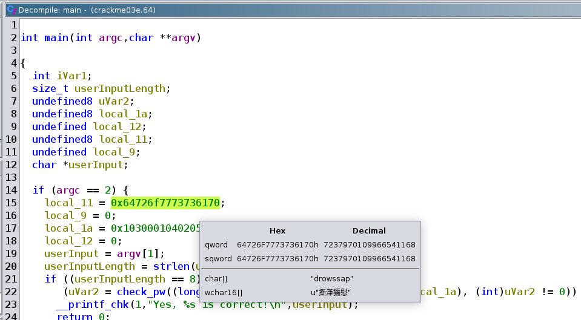
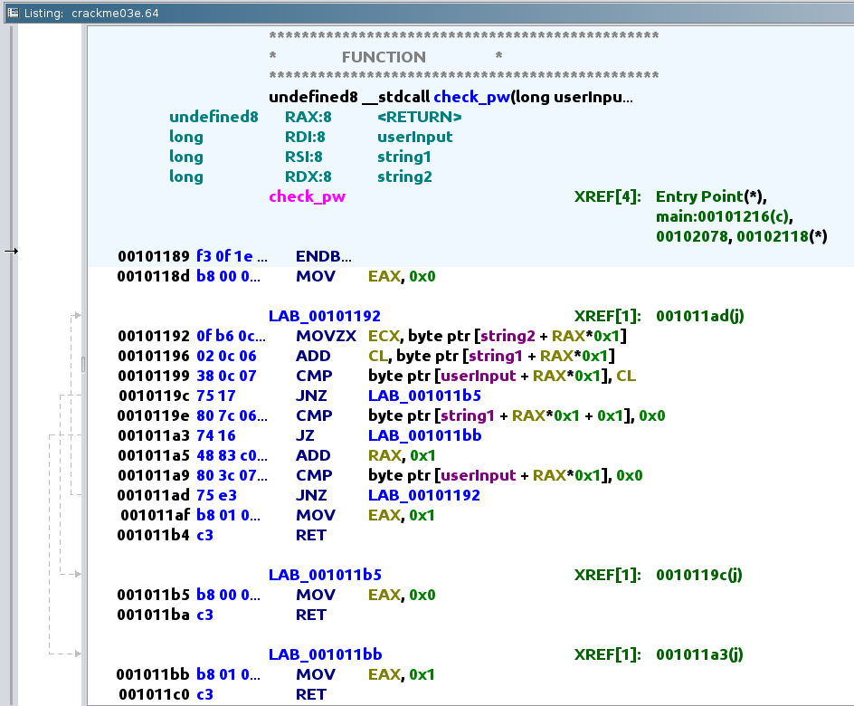
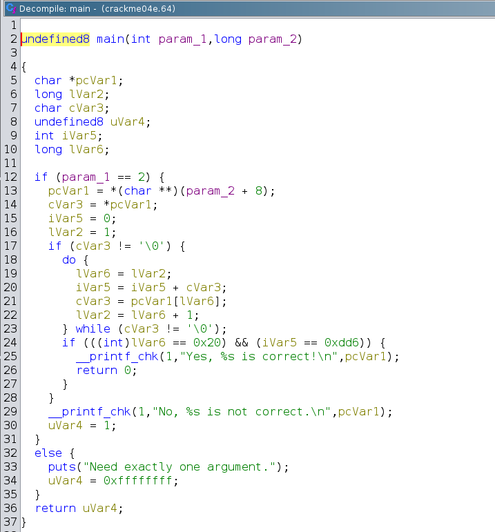
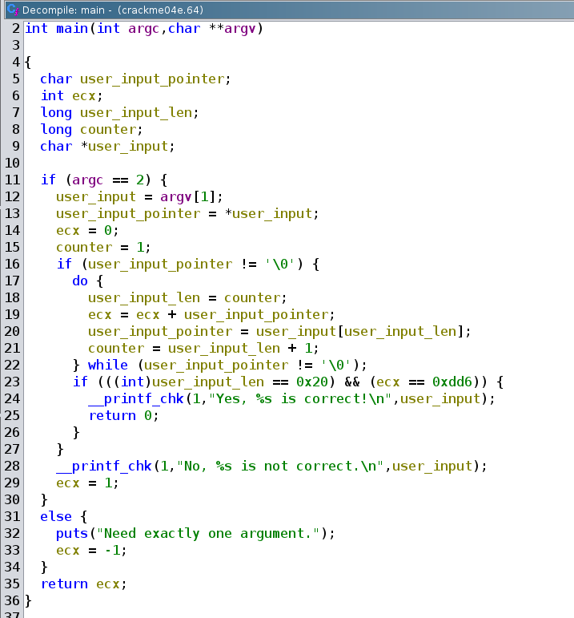

# Writeup for crackmes

## crackme01e.64

- Running `file` on the binary we can see it's just standard ELF64 binary file:

```sh
noobuntu@noobuntu-VirtualBox:~/crackmes$ file ./crackme01e.64
./crackme01e.64: ELF 64-bit LSB pie executable, x86-64, version 1 (SYSV), dynamically linked, interpreter /lib64/ld-linux-x86-64.so.2, BuildID[sha1]=dc572f8fa0e1152f3724106854852bbcd0ddccc4, for GNU/Linux 3.2.0, not stripped
```

- Running the program we see it requires one argument to be supplied:

```sh
noobuntu@noobuntu-VirtualBox:~/crackmes$ ./crackme01e.64 
Need exactly one argument.
```

- Supplying the argument and we don't seem to be lucky:

```sh
noobuntu@noobuntu-VirtualBox:~/crackmes$ ./crackme01e.64 secret
No, secret is not correct.
```

- Let's try running the `strings` command on it:

```sh
noobuntu@noobuntu-VirtualBox:~/crackmes$ strings ./crackme01e.64
/lib64/ld-linux-x86-64.so.2
__cxa_finalize
__printf_chk
__libc_start_main
strncmp
puts
libc.so.6
GLIBC_2.3.4
GLIBC_2.2.5
GLIBC_2.34
_ITM_deregisterTMCloneTable
__gmon_start__
_ITM_registerTMCloneTable
PTE1
u+UH
Need exactly one argument.
slm!paas.k
No, %s is not correct.
Yes, %s is correct!
:*3$"
```

- We can see suspicious looking string, let's try it as the password

```sh
noobuntu@noobuntu-VirtualBox:~/crackmes$ ./crackme01e.64 slm\!paas.k
Yes, slm!paas.k is correct!
```

## crackme02e.64

- It's just another ELF64 bit binary:

```sh
noobuntu@noobuntu-VirtualBox:~/crackmes$ file ./crackme02e.64
./crackme02e.64: ELF 64-bit LSB pie executable, x86-64, version 1 (SYSV), dynamically linked, interpreter /lib64/ld-linux-x86-64.so.2, BuildID[sha1]=0134cb26ecf6c2288bd9634fb1e1cb3d1ea216b6, for GNU/Linux 3.2.0, not stripped
noobuntu@noobuntu-VirtualBox:~/crackmes$ checksec ./crackme02e.64
[*] '/home/noobuntu/crackmes/crackme02e.64'
    Arch:     amd64-64-little
    RELRO:    Full RELRO
    Stack:    No canary found
    NX:       NX enabled
    PIE:      PIE enabled
    FORTIFY:  Enabled
```

- Running `strings` again:

```sh
noobuntu@noobuntu-VirtualBox:~/crackmes$ strings ./crackme02e.64
/lib64/ld-linux-x86-64.so.2
__cxa_finalize    
__printf_chk                                                                
__libc_start_main
puts                
libc.so.6            
GLIBC_2.3.4
GLIBC_2.2.5                                                                 
GLIBC_2.34    
_ITM_deregisterTMCloneTable   
__gmon_start__
_ITM_registerTMCloneTable
PTE1                      
u+UH                 
Need exactly one argument.  
No, %s is not correct.     
yuvmnpoi        
Yes, %s is correct!
```

- Let's try `yuvmnpoi` as the argument:

```sh
noobuntu@noobuntu-VirtualBox:~/crackmes$ ./crackme02.64 yuvmnpoi
No, yuvmnpoi is not correct.
```

- Interesting... Let's try to see which library functions are called:

```sh
noobuntu@noobuntu-VirtualBox:~/crackmes$ ltrace ./crackme02e.64 yuvmnpoi >/dev/null
__printf_chk(1, 0x5e46ff30501f, 0x7ffc7bfe02b8, 0)                                            = 29
+++ exited (status 1) +++
```

- It exits with `1` and just ends.
- Time for disassembly...
- Let's try disassembling it in `objdump` first, then we will switch to ghidra.

```sh
noobuntu@noobuntu-VirtualBox:~/crackmes$ objdump -Mintel -d ./crackme02e.64

./crackme02e.64:     file format elf64-x86-64

0000000000001169 <main>:
    1169:       f3 0f 1e fa             endbr64
    116d:       48 83 ec 08             sub    rsp,0x8
    1171:       83 ff 02                cmp    edi,0x2
    1174:       75 59                   jne    11cf <main+0x66>
    1176:       48 8b 76 08             mov    rsi,QWORD PTR [rsi+0x8]
    117a:       b8 79 00 00 00          mov    eax,0x79
    117f:       b9 00 00 00 00          mov    ecx,0x0
    1184:       48 8d 3d ac 0e 00 00    lea    rdi,[rip+0xeac]        # 2037 <_IO_stdin_used+0x37>
    118b:       0f b6 14 0e             movzx  edx,BYTE PTR [rsi+rcx*1]
    118f:       84 d2                   test   dl,dl
    1191:       74 19                   je     11ac <main+0x43>
    1193:       0f be c0                movsx  eax,al
    1196:       83 e8 02                sub    eax,0x2
    1199:       0f be d2                movsx  edx,dl
    119c:       39 d0                   cmp    eax,edx
    119e:       75 42                   jne    11e2 <main+0x79>
    11a0:       48 83 c1 01             add    rcx,0x1
    11a4:       0f b6 04 0f             movzx  eax,BYTE PTR [rdi+rcx*1]
    11a8:       84 c0                   test   al,al
    11aa:       75 df                   jne    118b <main+0x22>
    11ac:       48 89 f2                mov    rdx,rsi
    11af:       48 8d 35 8a 0e 00 00    lea    rsi,[rip+0xe8a]        # 2040 <_IO_stdin_used+0x40>
    11b6:       bf 01 00 00 00          mov    edi,0x1
    11bb:       b8 00 00 00 00          mov    eax,0x0
    11c0:       e8 ab fe ff ff          call   1070 <__printf_chk@plt>
    11c5:       b8 00 00 00 00          mov    eax,0x0
    11ca:       48 83 c4 08             add    rsp,0x8
    11ce:       c3                      ret
    11cf:       48 8d 3d 2e 0e 00 00    lea    rdi,[rip+0xe2e]        # 2004 <_IO_stdin_used+0x4>
    11d6:       e8 85 fe ff ff          call   1060 <puts@plt>
    11db:       b8 ff ff ff ff          mov    eax,0xffffffff
    11e0:       eb e8                   jmp    11ca <main+0x61>
    11e2:       48 89 f2                mov    rdx,rsi
    11e5:       48 8d 35 33 0e 00 00    lea    rsi,[rip+0xe33]        # 201f <_IO_stdin_used+0x1f>
    11ec:       bf 01 00 00 00          mov    edi,0x1
    11f1:       b8 00 00 00 00          mov    eax,0x0
    11f6:       e8 75 fe ff ff          call   1070 <__printf_chk@plt>
    11fb:       b8 01 00 00 00          mov    eax,0x1
    1200:       eb c8                   jmp    11ca <main+0x61>

```

- At the very top we see stack allocation and some comparing.

```asm
    1171:       83 ff 02                cmp    edi,0x2                                                                                                   
    1174:       75 59                   jne    11cf <main+0x66>
```

- If `edi` is not equal to 2 it will jump to `11cf`, what's on `11cf`?

```asm
    11cf:       48 8d 3d 2e 0e 00 00    lea    rdi,[rip+0xe2e]        # 2004 <_IO_stdin_used+0x4>
    11d6:       e8 85 fe ff ff          call   1060 <puts@plt>
    11db:       b8 ff ff ff ff          mov    eax,0xffffffff
    11e0:       eb e8                   jmp    11ca <main+0x61>
```

- It `lea`s something into rdi (*recall that rdi is the first argument when calling a function*).
- Then it calls `puts` function moves some crap into `eax` and jumps to `11ca`.
- And this is what `11ca` looks like:

```asm
    11ca:       48 83 c4 08             add    rsp,0x8
    11ce:       c3                      ret
```

- It deallocated the stack and just returns.
- Now what's that thing that gets loaded into `rdi`?
- `lea` calculates the address of it by using `rip` of next instruction and adding `0xe2e` offset to it.
- Address of next instruction will be `11d6`, then `0x11d6 + 0xe2e = 0x2004`
- Let's use `xxd` to display 40 bytes at that location:

```sh
noobuntu@noobuntu-VirtualBox:~/crackmes$ xxd -s 0x2004 -l 0x40 crackme02e.64
00002004: 4e65 6564 2065 7861 6374 6c79 206f 6e65  Need exactly one
00002014: 2061 7267 756d 656e 742e 004e 6f2c 2025   argument..No, %
00002024: 7320 6973 206e 6f74 2063 6f72 7265 6374  s is not correct
00002034: 2e0a 0079 7576 6d6e 706f 6900 5965 732c  ...yuvmnpoi.Yes,
```

- Alright, so `edi` is actually the argument count (*argc*), and if it's not equal to 2 it prints that string and exits.


#### First solution 

- So if we are not jumping to `11cf` what's next that we are doing?

```asm
    1176:       48 8b 76 08             mov    rsi,QWORD PTR [rsi+0x8]
    117a:       b8 79 00 00 00          mov    eax,0x79
    117f:       b9 00 00 00 00          mov    ecx,0x0
    1184:       48 8d 3d ac 0e 00 00    lea    rdi,[rip+0xeac]        # 2037 <_IO_stdin_used+0x37>
    118b:       0f b6 14 0e             movzx  edx,BYTE PTR [rsi+rcx*1]
    118f:       84 d2                   test   dl,dl
    1191:       74 19                   je     11ac <main+0x43>
```

- It moves a `QWORD` at the specific offset into `rsi`. Turns out __this is a second argument we supply__ in x86_64 calling convention.
- So `rsi` has `argv[1]`.
- Using the same technique with the `lea` offset we see that at `0x2037` there's:

```sh
noobuntu@noobuntu-VirtualBox:~/crackmes$ xxd -s 0x2037 -l 0x40 ./crackme02e.64
00002037: 7975 766d 6e70 6f69 0059 6573 2c20 2573  yuvmnpoi.Yes, %s
00002047: 2069 7320 636f 7272 6563 7421 0a00 0000   is correct!....
00002057: 0001 1b03 3b34 0000 0005 0000 00c8 efff  ....;4..........
00002067: ff68 0000 00f8 efff ff90 0000 0008 f0ff  .h..............
```

- It then moves a `BYTE` from `rsi` at specific offset into `edx` and zero extends it.
- This just means that `edx` will have first byte of `argv[1]`, meaning first character of that string.
- *Whenever you see `test dl, dl` or similar, it's the same as if `cmp dl, 0` is written.*
- So it compares that byte we moved to first 8 bits of `edx` with 0 (NULL byte, effectively checking if string has ended).
- If they are __equal__, it jumps to `11ac`:

```asm
    11ac:       48 89 f2                mov    rdx,rsi
    11af:       48 8d 35 8a 0e 00 00    lea    rsi,[rip+0xe8a]        # 2040 <_IO_stdin_used+0x40>
    11b6:       bf 01 00 00 00          mov    edi,0x1
    11bb:       b8 00 00 00 00          mov    eax,0x0
    11c0:       e8 ab fe ff ff          call   1070 <__printf_chk@plt>
    11c5:       b8 00 00 00 00          mov    eax,0x0
    11ca:       48 83 c4 08             add    rsp,0x8
    11ce:       c3                      ret
```

- It then moves contents of `rsi` to `rdx`.
- `lea`s rsi the following string:

```sh
noobuntu@noobuntu-VirtualBox:~/crackmes$ xxd -s 0x2040 -l 0x20 ./crackme02e.64
00002040: 5965 732c 2025 7320 6973 2063 6f72 7265  Yes, %s is corre
00002050: 6374 210a 0000 0000 011b 033b 3400 0000  ct!........;4...
```

- Moves some stuff around, calls `printf` and returns 0.
- This means that __supplying empty string `""` as the second argument__ would get us our prize.

```sh
noobuntu@noobuntu-VirtualBox:~/crackmes$ ./crackme02e.64 ""
Yes,  is correct!
```

#### Second solution

- Even though we already solved this challenge, it's worth digging around for more.
- So we don't supply the empty string, jump doesn't happen, what's next?

```asm
    1193:       0f be c0                movsx  eax,al
    1196:       83 e8 02                sub    eax,0x2
    1199:       0f be d2                movsx  edx,dl
    119c:       39 d0                   cmp    eax,edx
    119e:       75 42                   jne    11e2 <main+0x79>
```

- It moves `al` into `eax` with sign extension.
- Then it subtracts `eax` by 2.
- Then it moves `dl` into `edx` with sign extension.
- And finally compares `eax` with `edx`, if they are not equal it jumps to `11e2`.

```asm
    11e2:       48 89 f2                mov    rdx,rsi
    11e5:       48 8d 35 33 0e 00 00    lea    rsi,[rip+0xe33]        # 201f <_IO_stdin_used+0x1f>
    11ec:       bf 01 00 00 00          mov    edi,0x1
    11f1:       b8 00 00 00 00          mov    eax,0x0
    11f6:       e8 75 fe ff ff          call   1070 <__printf_chk@plt>
    11fb:       b8 01 00 00 00          mov    eax,0x1
    1200:       eb c8                   jmp    11ca <main+0x61>
```

- `lea` loads following string:

```sh
noobuntu@noobuntu-VirtualBox:~/crackmes$ xxd -s 0x2018 -l 0x20 ./crackme02e.64
00002018: 756d 656e 742e 004e 6f2c 2025 7320 6973  ument..No, %s is
00002028: 206e 6f74 2063 6f72 7265 6374 2e0a 0079   not correct...y
```

- Not analyzing this further, we can conclude that it jumps here if it's not pleased with our input.
- Not following that jump we come to:

```asm
    11a0:       48 83 c1 01             add    rcx,0x1
    11a4:       0f b6 04 0f             movzx  eax,BYTE PTR [rdi+rcx*1]
    11a8:       84 c0                   test   al,al
    11aa:       75 df                   jne    118b <main+0x22>
```

- Increments `rcx` and moves next byte from the `argv[1]`.
- It then checks to see if that byte isn't 0, if it's not, then it jumps to `118b`
- This is actually a loop! See for yourself:

```asm
    118b:       0f b6 14 0e             movzx  edx,BYTE PTR [rsi+rcx*1]     
    118f:       84 d2                   test   dl,dl       
    1191:       74 19                   je     11ac <main+0x43>
    1193:       0f be c0                movsx  eax,al                                                                                                    
    1196:       83 e8 02                sub    eax,0x2             
    1199:       0f be d2                movsx  edx,dl                                                                                                    
    119c:       39 d0                   cmp    eax,edx             
    119e:       75 42                   jne    11e2 <main+0x79>    
    11a0:       48 83 c1 01             add    rcx,0x1                                                                                                   
    11a4:       0f b6 04 0f             movzx  eax,BYTE PTR [rdi+rcx*1]
    11a8:       84 c0                   test   al,al                                                                                                     
    11aa:       75 df                   jne    118b <main+0x22>
```

- Here's what this loop actually does.
- At the beginning it loads `edx` with `argv[1][rcx]`, because `rcx` at the beginning is 0, it loads first character.
- The main condition is that it compares `eax` and `edx`.
- Now `edx` contains a character from our supplied string and `eax` contains a character from `yuvmnpoi` string.
- Now here's the catch.
- Before comparing two chars it subtracts `0x2` from each ASCII hex value of the string `yuvmnpoi` before comparing it with our string.
- If they match, it loops again if they don't match you fail.
- That means that you take `yuvmnpoi` and convert it into: `wstklnmg`

```sh
noobuntu@noobuntu-VirtualBox:~/crackmes$ ./crackme02e.64 wstklnmg
Yes, wstklnmg is correct!
```

- But because the binary is made this way, something like these also get accepted as correct:

```sh
noobuntu@noobuntu-VirtualBox:~/crackmes$ ./crackme02e.64 w
Yes, w is correct!
noobuntu@noobuntu-VirtualBox:~/crackmes$ ./crackme02e.64 ws
Yes, ws is correct!
```

- Have a look at source code for `crackme02e.64` and you will realize why is that the case.

```c
    int i = 0;
    while(correct[i] != 0 && argv[1][i] != 0) {
        if (correct[i] - 2 != argv[1][i]) {
            printf("No, %s is not correct.\n", argv[1]);
            return 1;
        }
        i++;
    }
```


## crackme03.64

- Because `objdump` can be difficult to use on more complex programs, this time for solving this challenge I will use `ghidra`.
- This file just like ones before is ELF64 binary.
- Running simple `strings` on it, we can see something interesting:

```sh
noobuntu@noobuntu-VirtualBox:~/crackmes$ strings -n5 -d ./crackme03e.64
/lib64/ld-linux-x86-64.so.2
aN*~`
__cxa_finalize
__printf_chk
__libc_start_main
strlen
libc.so.6
GLIBC_2.3.4
GLIBC_2.2.5
GLIBC_2.34
_ITM_deregisterTMCloneTable
__gmon_start__
_ITM_registerTMCloneTable
passwordH
Need exactly one argument.
Yes, %s is correct!
No, %s is not correct.
:*3$"
```

- Running the program with that string doesn't get us crap:

```sh
noobuntu@noobuntu-VirtualBox:~/crackmes$ ./crackme03e.64 passwordH
No, passwordH is not correct.
```

- When analyzing the binary in ghidra, be sure to check `Decompiler Parameter ID` analyzer.
- This is decompiled main:




- We can right click on it and edit function signature (not necessary) and enter: `int main(int argc, char **argv)`
- At the top of main we can see it defines some local variables that will be on the stack.
- It then checks if we supplied an argument when calling, if we did it proceeds, if not it returns 1 and prints a string.
- It sets some of these variables with some values and also sets a pointer to our argument.
- It sets `sVar2` to a length of our argument.
- The if condition checks if our argument's length is 8 and if return value of called function (`check_pw`) is non zero.
- This is slightly renamed/cleaned main for clarity:



- Let's analyze this `check_pw` function.
- This is how ghidra decompiles it:



- First argument to this new function is our input, second is `local_11` and third is `local_1a`.
- *Notice* `local_11` is renamed to `string1` and `local_1a` is renamed to `string2` for clarity.
- We need to figure out what these variables hold inside.
- Going back in main decompiled window and hovering over `0x64726f7773736170` we can see ghidra helps us with deciphering what it means.



- It get's represented as a string `drowssap`.
- With `0x103000104020503` we have less luck, as it's just junk characters.
- At this point it might be easier to just look at how ghidra disassembled `check_pw` and figure out things from there.



- Because we seek 1 as a return value, we must fail first if statement.
- This means that our `userInput` variable has to be the same as contents of register `CL`.
- Because at the beginning of a function, `rax` is set to zero, register `CL` holds first byte of `string1`.
- So `CL` holds letter `d`.
- __So far, we know correct input needs to be 8 characters long and it needs to start with `d`.__
- Going back to decompiled window, we see that second if will break the while loop only if `string1` has reached the end.
- If it doesn't break the loop `lVar1` gets incremented.
- Third if checks if we reached the end of our `userInput` string. If we did, return 1.
- Now, trying to enter `drowssap` and hoping it would be correct results in failure:

```sh
noobuntu@noobuntu-VirtualBox:~/crackmes$ ./crackme03e.64 drowssap
No, drowssap is not correct.
```

- That only means that `check_pw` is somehow modifying this string and comparing each byte from our input with that modified string.
- Look at the disassembly of first if block:

```asm
00101192  0f b6 0c           MOVZX   ECX, byte ptr [string2 + RAX*0x1]
00101196  02 0c 06           ADD          CL, byte ptr [string1 + RAX*0x1]
00101199  38 0c 07           CMP          byte ptr [userInput + RAX*0x1], CL
```

- Remember that `string2` has `0x103000104020503`, well this data isn't junk at all.
- It moves first byte from `string2` which is `0x01` and zero extends it into `ecx`.
- Then it adds first byte from `string1` which is `d` into `CL`.
- But because of the first move, this `d` get's actually converted into `e` (because `0x64 + 0x01` is `0x65` which is `e`).
- That only means, every next letter get's it's ASCII value incremented by current byte in `string2`.
- So first letter got incremented by `0x01`, second with `0x03`, third with `0x00`....
- So `drowssap` becomes `euoxwufs`

- Well it looks like i'm wrong:

```sh
noobuntu@noobuntu-VirtualBox:~/crackmes$ ./crackme03e.64 euoxwufs
No, euoxwufs is not correct.
```

- Because it's little endian, you should be taking values from `string2` going backwards:
- __Big Endian__:
- Old letters: `0x64, 0x72, 0x6f, 0x77, 0x73, 0x73, 0x61, 0x70`
- Increments: `0x01, 0x03, 0x00, 0x01, 0x04, 0x02, 0x05, 0x03`
- New letters: `0x65, 0x75, 0x6f, 0x78, 0x77, 0x75, 0x66, 0x73`
- New string: `euoxwufs`

- __Little Endian__:
- Old letters: `0x64, 0x72, 0x6f, 0x77, 0x73, 0x73, 0x61, 0x70`
- Increments: `0x03, 0x05, 0x02, 0x04, 0x01, 0x00, 0x03, 0x01`
- New letters: `0x67, 0x77, 0x71, 0x7b, 0x74, 0x73, 0x64, 0x71`
- New string: `gwq{tsdq`

- So in little endian `drowssap` turns to `gwq{tsdq`. But that's aslo incorrect!

### Dynamic analysis 

- Time to switch from static analysis to dynamic analysis, let's start with `gdb`.

```sh
noobuntu@noobuntu-VirtualBox:~/crackmes$ gdb -q crackme03e.64
GEF for linux ready, type `gef' to start, `gef config' to configure
93 commands loaded and 5 functions added for GDB 12.1 in 0.00ms using Python engine 3.10
Reading symbols from crackme03e.64...
(No debugging symbols found in crackme03e.64)
```

- To my surprise `rsi` gets loaded with string `password`.
- `CL` gets value `0x73` which is 's'.

```sh
0x00005555555551d9 in main ()
────────────────────────────────────────────────────────────────────────────────────────────────────────────────────────────────────────── registers ────
$rax   : 0x64726f7773736170 ("password"?)
$rbx   : 0x0
$rcx   : 0x0000555555557db0  →  0x0000555555555140  →  <__do_global_dtors_aux+0000> endbr64
$rdx   : 0x00007fffffffdee0  →  0x00007fffffffe299  →  "SHELL=/bin/bash"
$rsp   : 0x00007fffffffdd90  →  0x0000000000000000
$rbp   : 0x2
$rsi   : 0x00007fffffffdec8  →  0x00007fffffffe26a  →  "/home/noobuntu/crackmes/crackme03e.64"
$rdi   : 0x2
$rip   : 0x00005555555551d9  →  <main+0018> mov QWORD PTR [rsp+0x17], rax
$r8    : 0x00007ffff7e1bf10  →  0x0000000000000004
$r9    : 0x00007ffff7fc9040  →  <_dl_fini+0000> endbr64
$r10   : 0x00007ffff7fc3908  →  0x000d00120000000e
$r11   : 0x00007ffff7fde660  →  <_dl_audit_preinit+0000> endbr64
$r12   : 0x00007fffffffdec8  →  0x00007fffffffe26a  →  "/home/noobuntu/crackmes/crackme03e.64"
$r13   : 0x00005555555551c1  →  <main+0000> endbr64
$r14   : 0x0000555555557db0  →  0x0000555555555140  →  <__do_global_dtors_aux+0000> endbr64
$r15   : 0x00007ffff7ffd040  →  0x00007ffff7ffe2e0  →  0x0000555555554000  →   jg 0x555555554047
$eflags: [ZERO carry PARITY adjust sign trap INTERRUPT direction overflow resume virtualx86 identification]
$cs: 0x33 $ss: 0x2b $ds: 0x00 $es: 0x00 $fs: 0x00 $gs: 0x00
──────────────────────────────────────────────────────────────────────────────────────────────────────────────────────────────────────── code:x86:64 ────
   0x5555555551ca <main+0009>      cmp    edi, 0x2
   0x5555555551cd <main+000c>      jne    0x555555555243 <main+130>
   0x5555555551cf <main+000e>      movabs rax, 0x64726f7773736170
 → 0x5555555551d9 <main+0018>      mov    QWORD PTR [rsp+0x17], rax
   0x5555555551de <main+001d>      mov    BYTE PTR [rsp+0x1f], 0x0
   0x5555555551e3 <main+0022>      movabs rax, 0x103000104020503
   0x5555555551ed <main+002c>      mov    QWORD PTR [rsp+0xe], rax
   0x5555555551f2 <main+0031>      mov    BYTE PTR [rsp+0x16], 0x0
   0x5555555551f7 <main+0036>      mov    rbx, QWORD PTR [rsi+0x8]
```

- Now I get it, ghidra displayed `password` as `drowssap` respecting little endian.
- To my mistake, I've only read the `string2` from right to the left and not `string1`.
- Let's try to convert manually again:

- Old letters: `0x70, 0x61, 0x73, 0x73, 0x77, 0x6f, 0x72, 0x64`
- Increments: `0x03, 0x05, 0x02, 0x04, 0x01, 0x00, 0x03, 0x01`
- New letters: `0x73, 0x66, 0x75, 0x77, 0x78, 0x6f, 0x75, 0x65`

- These new letters when converted to ascii with my simple python script translate to:

```sh
$ python3 hextoascii.py
Enter hex string without '0x' (616263): 73667577786f7565
sfuwxoue
```

- Feed this string into our program and prosper:

```sh
noobuntu@noobuntu-VirtualBox:~/crackmes$ ./crackme03e.64 sfuwxoue
Yes, sfuwxoue is correct!
```

## crackme04e.64

- Yet another ELF64 binary that we will open up in ghidra.
- Running it with something dumb:

```sh
noobuntu@noobuntu-VirtualBox:~/crackmes$ ./crackme04e.64 arg
No, arg is not correct.
```

- Let's dive right into decompiled main that ghidra gives us.



- Renaming a couple of things in the decompilation window and we can get simpler code to work with.



- So it declares some variables and initializes them below.
- First if statement checks if we reached the end of our input string.
- If we did reach the end, condition is false and we fail.
- However if we haven't reached the end, it goes into a do-while loop.
- It loop through our given string and adds each non-zero byte to `ECX`.
- At the end of each iteration it checks if it reached NULL byte.
- When it reaches the end, do-while loop breaks and next if statement is checked.
- This if statement checks two things:
1. If legth of given string is __exactly__ 32 characters long.
2. If `ECX` at the end holds decimal value `3542`.

- If those checks are true, we get success string printed out.

- So we need to feed it a string that is exactly 32 characters long, and we need their ascii values to be summed to `3542`.
- Looking at the `man 7 ascii` we can accomplish this easily.
- First, `s` has decimal value `115`, `115 * 30 = 3450`.
- We need `92` more, but only with 2 characters, well `92 / 2 = 46`.
- Consulting the ascii table, `.` has decimal value `46`.
- Let's craft our input with python:

```py
>>> print('s'*30+'.'*2)
ssssssssssssssssssssssssssssss..
```

- ...And feed it into our program:

```sh
noobuntu@noobuntu-VirtualBox:~/crackmes$ ./crackme04e.64 ssssssssssssssssssssssssssssss..
Yes, ssssssssssssssssssssssssssssss.. is correct!
```
