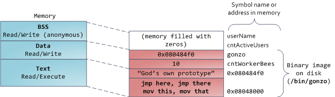

# Virtual Memory

- Linux works with virtual memory.
- Each process has it's own __address space__ which is 4GB block of memory addresses (in 32-bit systems).
- Virtual addresses are mapped to __physical addresses__ either on __RAM__ or __hard disk__ through something that's called __page tables__.

## Kernel space in virtual memory

- Virtual addresses apply to all software, kernel included.
- Which means from 4GB block of memory, __1GB is reserved for kernel mode space__ and __3GB are reserved for user mode space__.
- Kernel maps itself in every and all processes, ready for *interrupts and syscalls.*
- When user space programs try to access that kernel space, they error out with __page fault__.

## Memory segments

- For every process the offset to particular memory segments such as the stack, memory mapping segment, and the heap is __random__.
- This is safety mechanism, and it's called __Address Space Layout Randomization (ASLR)__.
- *Notice:* ASLR on 32-bit machines is tight, leaving little space for randomization.
- It's interesting to also note, that the stack expands if possible and needed (__expand_stack()__). If it's not possible to expand stack, then __stack overflow__ happens.
    - When it does happen, we get __segmentation fault__ error and our program crashes.
- Access to unmapped memory region (except for stack) results in segfault.
- Write attempts to read only segments also results in segfault.

### Memory mapping segment
- This is a segment which uses __`mmap()`__ system call to map contents of files to physical memory.
- When `mmap()` is used for program data, that's what's called __anonymous memory mapping__.
- Note that, user requested block of memory larger than *128kB* via __`malloc()`__ will result in anonymous memory mapping by `mmap()` (no heap memory allocated).

### Heap
- It's a memory allocated at runtime, that is supposed to outlive the stack memory when a function ends.
- Heap memory's inner workings is complex.
- Heap is also fragmented:

### bss, data, and program text

- bss memory area stores __uninitialized__ static (global) variables in C.
- bss memory is *anonymous* (no mappings at all).
- Data memory area stores __initialized__ static (global) variables.
- It's not anonymous, because it's mappings are __private__.
- Which means updating it won't change the underlying file.
    - If it would change the underlying file it would overwrite the actual on-disk binary image.
- Data section will store all those variables in executable, unlike __assembly directives__ which are not stored at all.
- Text memory section stores all string literals and program's code.

- *Notice:* data segment means data + bss + heap.

# How the kernel manages memory

---

Sources: 
1. https://web.archive.org/web/20240425201419/https://manybutfinite.com/post/anatomy-of-a-program-in-memory/
2. https://web.archive.org/web/20240425203544/https://manybutfinite.com/post/how-the-kernel-manages-your-memory
