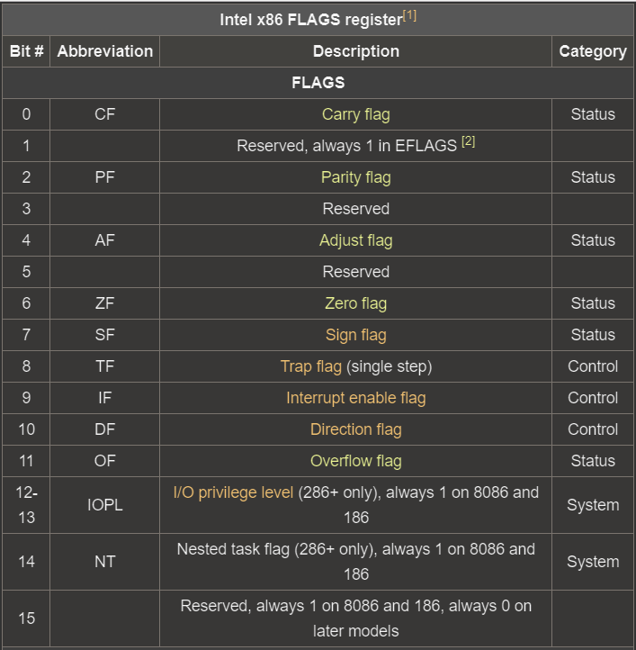

# Flags and conditional jumps

- __EFLAGS__ is *32-bit* register which holds bits for variety of different flags.
- These flags indicate results of executed instructions by the CPU.
- And these flags are also altered within the program by instructions.
- Some of most important __conditional (status)__ flags and their bit position are:
1. __CF (Carry Flag)__
    - Set if last operation carried (addition) or borrowed (subtraction) a bit beyond the register limit.
2. __PF (Parity Flag)__
3. __AF (Auxilary Carry Flag)__
    - Carry for BCD* arithmetics.
4. __ZF (Zero Flag)__ 
    - Set if result of last instruction was zero.
5. __SF (Sign Flag)__ 
    - Set if result of last instruction was a negative number.
6. __OF (Overflow Flag)__
    - Set if resulted sign value is too big for the register to contain.

- Flags at bits: 1,3,5 are __RESERVED__
- There are also __control flags__ which enable or disable certain CPU instructions:
1. __TF (Trap Flag)__
    - Debugging signal.
2. __IF (Interrupt Flag)__
    - Interrupt signal.
3. __DF (Direction Flag)__
    - If set, reads memory backwards.




## Comparisons and conditional jumps

### cmp

```asm
cmp eax, ecx
je location
```

- This will perform __comparison between the two values__.
- Compare instruction will subtract __ECX__ from __EAX__ (signed), and change above mentioned status flags accordingly.
- It's most closely related to __sub__ instruction, except that the __result is discarded.__
- If the result is zero, __ZF__ flag is set to 1.
- If the result is negative, __SF__ flag is set to 1.

### je 

- __`je`__ is short for __jump if equal__ and is equivalent to __`jz`__ which is __jump if ZF is set__.
    - It will jump to a `location` if, both operands are equal.
    - Meaning that if __EAX__ and __ECX__ both contain same value, or in other words, if __ZF__ flag is set.
- *A `location` is location in memory or a defined label.*


### jne

```asm
cmp eax, 5
jne location
```

- `cmp eax, 5` makes the difference between register EAX and *immediate value 5*.
- `jne` is short for __jump if not equal__, and is similar to __jnz__ which is __jump if not zero__.
- `jne` will make a jump to a `location` if EAX is not equal to 5, in other words it will make a jump only if __ZF__ is equal to 0.

### jg

```asm
cmp eax, ecx
jg location
```
- __`jg`__ stands for __jump if greater__, and will perform signed comparison between the two operands.
- Above code says that, `jg` will jump to the `location` if __EAX > ECX__.

### jge

- Same as `jg` except that __`jge`__ stands for __jump if greater or equal__.
- So it would mean __EAX >= ECX__.

### ja

```asm
mov eax, -1
cmp eax, ecx
ja location
```

- __`ja`__ stands for __jump if above__ and it's similar to `jg`, except that `ja` will perform __unsigned comparison__.
- That means that the above code, will always jump to `location`, because `-1` in unsigned way is interpreted as all 1s for a N-bit value, where N is bit length of register.

### jae

- __`jae`__ or __jump if above or equal__ is same as `jge` except it performs unsigned comparison.

### jl

```asm
cmp eax, ecx
jl location
```

- __`jl`__ is short for __jump if lesser__ and it jumps to a `location` if certain conditions are met:
1. __EAX < ECX__ and __OF__ flag is not set, but __SF__ will be set
2. __EAX > ECX__ and __OF__ flag is set, but __SF__ is not set

- In other words, it will jump only if either __OF__ or __SF__ is set, but __not__ both!
- All other cases will be discarded and `jl` will not jump to a `location`.
- __In plain language, it will jump only if operand1 is less than operand2.__

### jle

- __`jle`__ is short for __jump if less or equal__ and it will jump to a `location` if __SF != OF__ (as in for `jl`) OR __ZF__ = 1.
- In other words, operand1 is lesser than or equal to operand2.

### jb

```asm
mov eax, 0
cmp eax, ecx
jb location
```

- __`jb`__ is short for __jump if below__ and it's same as `jl` except that it will perform __unsigned__ comparison between the two operands.
- __CF__ = 1

### jbe

- __`jbe`__ is __jump if below or equal__ and it's the same as `jle` except that it will perform __unsigned__ comparison.
- __CF = 1 or ZF = 1__

## Jumps based on condition code

- These jumps will take place only if certain flag is set or if it isn't set!
- `jz` is __jump if zero__ and will jump only if __ZF = 1__
- There are also: `jnz`, `js`, `jns`, `jc`, `jnc`, `jo`, `jno`, `jcxz`, `jecxz`
- Where `jcxz` is __jump if register CX = 0__ and where `jecxz` is __jump if register ECX is = 0__.
    - *Notice* these jumps can be really useful to evade infinite loops.


## Loops

```asm
mov ecx, 5
mov eax, 0

head:
    add eax, 1
    loop head
```

- `loop arg` instruction will jump to a location specified in arg (label `head`) unless __ECX__ is equal to 0.
- __ECX__ is decremented every iteration.

### Loop variations

- Format: `loopcc arg`
    - Jumps to `arg` if certain __condition code__ is satisfied and __ECX__ is not 0.
    - `loope` loop if equal
    - `loopne` loop if not equal
    - `loopnz` loop if not zero
    - `loopz` loop if zero

---

### To-Do

*Figure out why you cant compare eax, ebx and do arithmetics with them without resulting in segfault.*
- Possible solution: It's becasue EAX is accumulator register and EBX is base register. They are used for different purposes and can't be compared or done arithmetics with.

---

#### Resources:

+ https://riptutorial.com/x86/example/6976/flags-register
+ https://en.wikibooks.org/wiki/X86_Assembly/Control_Flow

*BCD - Binary Coded Decimal, legacy encoding scheme.
