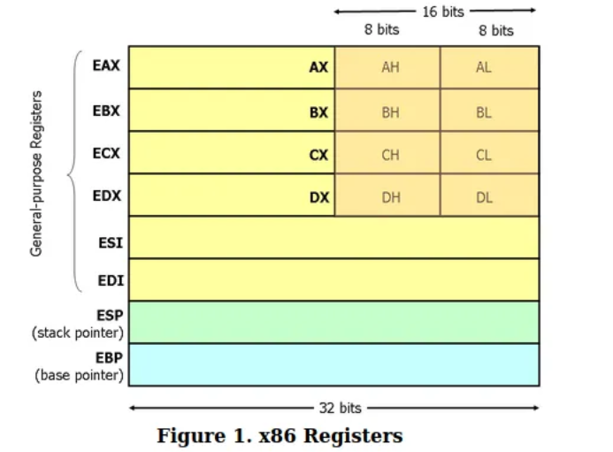

#### Source: https://www.youtube.com/watch?v=75gBFiFtAb8

Get some background info on stack and heap, some instructions and some registers [✓]

---

# Components of a program

1. Heap
2. Stack
3. Registers
4. Instructions

# Heap

- Is dynamic memory controlled by a programmer.
- Functions like malloc, calloc, global and static variables reside inside heap.
- Extremely complicated inner workings.

# Registers

- Small variables that live in CPU.
- Extremely fast.
- Store values or memory addresses.

### x86 registers

- x86 assembly allows 32 bits of information to be stored in each register.
- General purpose: __EAX, EBX, ECX, EDX, ESI, EDI__
- Special purpose: __EBP, ESP, EIP__

- x86 registers are backwards compatible with 16 bit registers.
- That is why we can access __16 bit__ parts of our registers, so to access the 16 bit part of __EAX__ you will type __AX__, for EBX you type BX...
- Similar thing for the 8 bit registers, because 16 bit registers are also divided on two 8 bit registers for __AX__ that is: __AL__ the lower 8 bits register, __AH__ the higher 8 bits register.
- Purpose:
1. __EAX__ is called Accumulator register
    - Used for I/O, arithmetic, interrupt calls
2. __EBX__ is called Base register
    - Used as a base pointer for memory access
3. __ECX__ is called Counter register
    - Used for loops and shifts
4. __EDX__ is called Data register
    - Used for I/O access, arithmetic, some interrupt calls.

# Stack

- Stack is a __LIFO__ structure in memory.
- __LIFO__ is Last In First Out (think dishes).
- Two operations: __push and pop__
- Elements that are added are *pushed* on __top__ of the stack.
- __Last element__ which was added on the stack, is the first one that gets *popped* (removed).
- Stack __grows towards lower memory__ addresses.
    - Highest address, lowest position on stack.
    - Lowest address, highest position on stack.
- Every function has it's own __stack frame__.
    - Stack frame is portion of the stack reserved only for that function.
    - Every local variable is stored on that stack frame.

## Special purpose registers

- *ebp* (base pointer) contains the address of the lowest element on the stack frame.
- *esp* (stack pointer) contains the address of the first element on the stack frame.

- __Function prolog__ is background memory arithmetics performed when creating stack frame.
- ebp is pushed onto the stack, esp has the same value as ebp.
- Then esp gets decremented (stack expands) to create a stack frame.
- In other words stack frame is __everything between esp and ebp.__
- Local variables are stored on the stack frame, at the offsets of their sizes.
    - So an integer is stored ebp-0x4 (int is 4 bytes).
- Passing values by argument, __doesn't__ move the actual value.
- Arguments are __copied into separate register__ from where they are moved on to the next free position in function's stack frame.

# Instructions

- Format:
    - __operation__ *arg*
    - __operation__ *arg1*, *arg2*

## mov

- __mov arg1, arg2__
- Copies value from the location at __arg2__ to the location of __arg1__.
- mov won't actually copy the value from the stack frame, but it's address:
    - __mov eax, ebp-0x8__ => copies address at ebp-0x8 to eax.
- mov can copy the value from the stack frame using []:
    - __mov eax, [ebp-0x8]__ => copies the value that ebp-0x8 __is POINTING TO__, to the eax register.

## add

- __add arg1, arg2__
- If value at eax is 10, then: __add eax,0x5__ will update __eax__ with value __15__!

## sub

- Value from the second argument is subtracted from the value of the first argument and finally stored at the first argument.
- __sub eax,0x5__ updates eax with 10!

## push and pop

- __push arg__
    - Pushes the argument to the top of the stack.
    - It decrements esp by the size of arg.

- __pop reg__
    - Will move last value added on the stack to the register __reg__.
    - It will also increment the stack pointer.

## leave/ret

- __leave__ Destroys the stack frame once the function is over.
    - Decrements esp to ebp and pops of the rest of the stack.
- __ret__ sets the address of eip to the __return address__ of a calling function.

## cmp

- Equivalent to sub instruction, expect that when it subtracts first from second, it stores the result in special __flag register__
- __flag register__ can have following values: \<0, 0 or \>0 
- __cmp 1,3__ => 1-3 = -2 so it stores \<0 in __flag__ register.

## jmp

- Always follows cmp instruction.
- jmp \<addr> jumps to that address.
- Few types of jump: jg, jne, jl...
