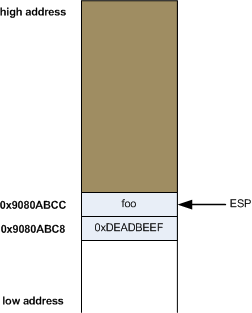

# The stack structure in x86 assembly

## LIFO (Last In First Out) Analogy

- Stack can be thought of as a pile of dishes.
- You put the dish on top of the pile, and you take a dish from top of the pile.
- In computing, this is how stack functions basically, stack is a __LIFO__ structure.
- You __push__ the value on top of the stack, and you __pop__ the most recently added value from the top.
- It's purpose is to store temporary data such as function variables and parameters.

## Stack is a region in memory

- Stack is a region in memory that starts at some address and __grows DOWNWARDS__ toward lower addresses.
- So the top of the stack is actually the __last memory address that the stack occupies__.
- __ESP__ (Extended Stack Pointer) is special register that always points to the __top__ of the stack.

## `push` and `pop` operations in assembly

- To add a new value on top of the stack from `EAX` register:

```asm
sub esp, 4
mov [esp], eax
```

- Which is equivalent to:

```asm
push eax
```

- So it decrements the `ESP` by 4 bytes (word) and writes value from `EAX` to that memory location.


- Pushing `0xdeadbeef` to the stack:


- Now to get the top value from the stack and put it into `EAX`:

```asm
mov eax, [esp]
add esp, 4
```

- Which is the same as:

```asm
pop eax
```



- Notice how `0xdeadbeef` still stays on `0x9080abc8` until it's overwritten by another `push`.
    - It's not a part of the stack anymore, but it remains in memory.

- Now to access a double word value that is just before the top value (assuming the top value is double word):

```asm
mov eax, [esp + 4]
mov ax, [esp + 4]       ; if the value was word, you use AX
```

## Stack frame

- Consider the example code `frame.c`, generate the assembly code from the C source.
- Or decompile it with objdump:

```sh
$ gcc -masm=intel -S frame.c -o bin/frame.asm -m32
$ objdump -M intel -D bin/frame
```

- Detailed explanation of assembly should be viewed in `frame.asm`.
- Now, this is how our stack frame looks like just before the `return` from the function `foobar`:


- Arguments/parameters are stored above `EBP` (positive offset), and local variables are stored below `EBP` (negative offset).
- *Notice:* it's not quite accurate the way my computer stored those local variables but it gives good visual.

- What `leave` does is equivalent to:

```asm
mov esp, ebp
pop ebp
```

- It basically destroys the local variables in `foobar` function and sets `EBP` with old `EBP` value.
- After that it just returns the address `EBP` has, which is address from which the function was called.
- Thus setting the `EIP` register to instruction in `main` after the function call.


---

Sources:
- https://eli.thegreenplace.net/2011/02/04/where-the-top-of-the-stack-is-on-x86/
